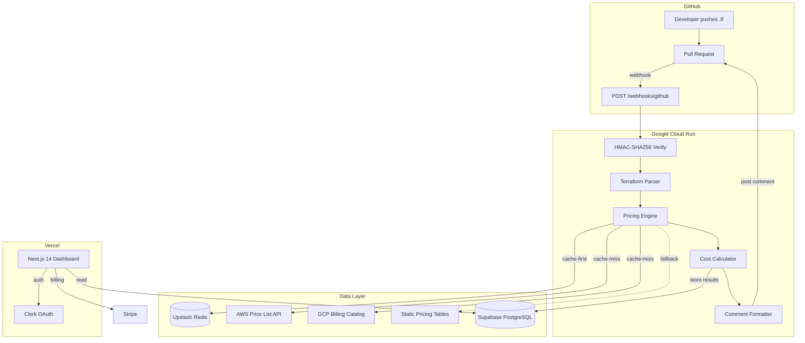
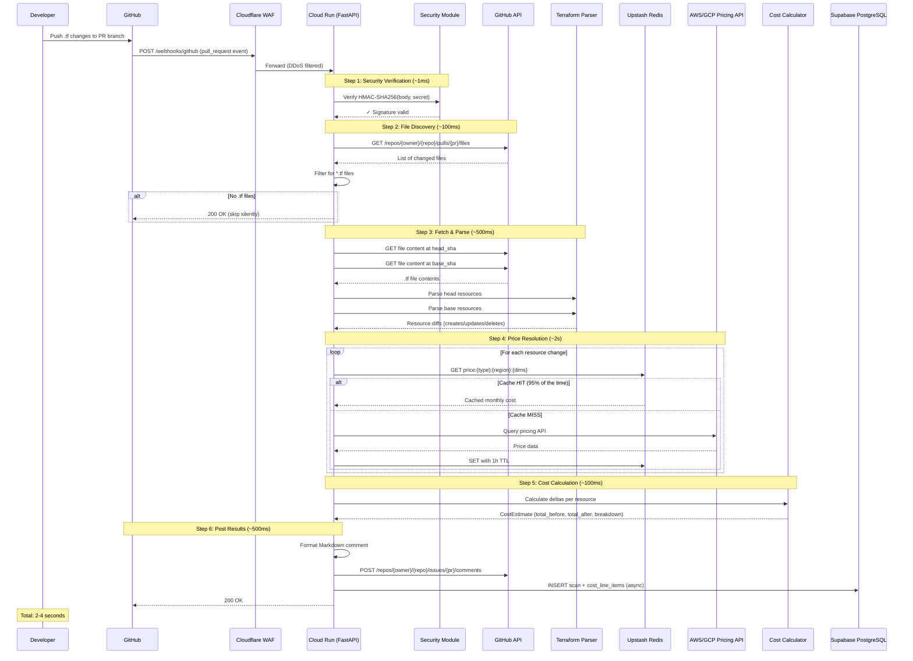
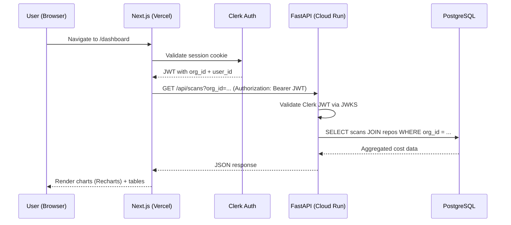
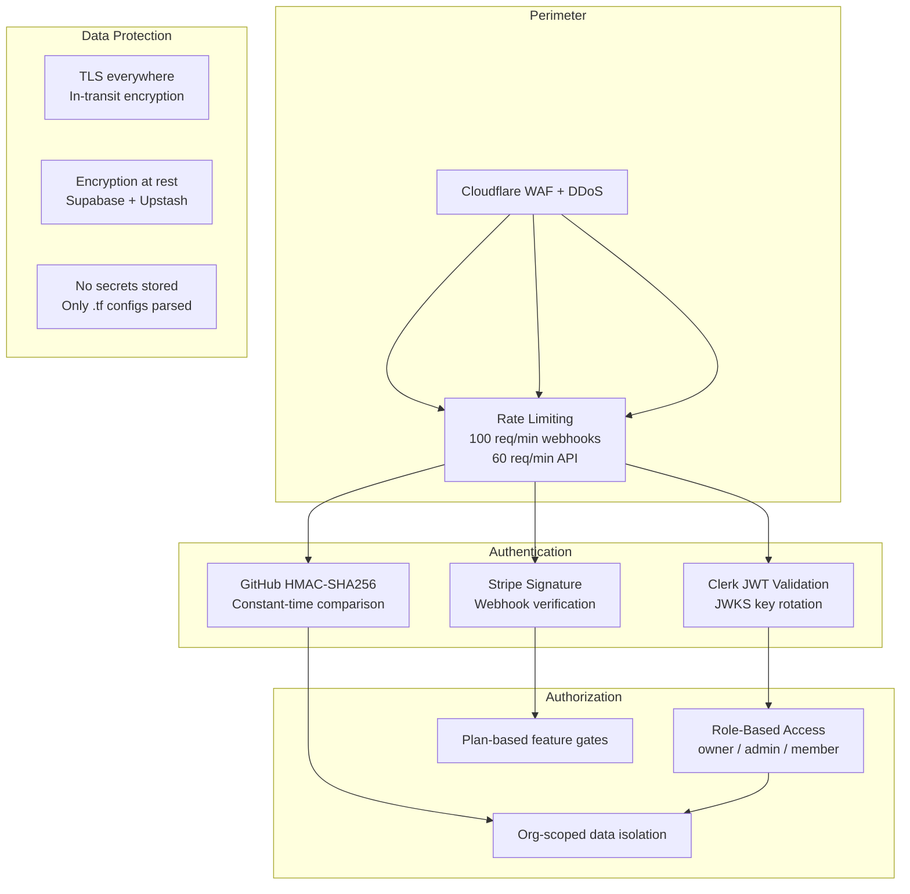
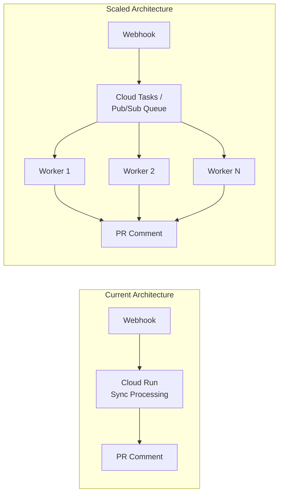

# InfraCents — Interview Preparation Guide

> **Your cheat sheet for explaining InfraCents in any interview context.**
> Target role: DevOps / MLOps / Platform / Cloud Engineer

---

## 1. Project Overview

### 30-Second Elevator Pitch

> "I built **InfraCents**, a GitHub App that automatically estimates the cost impact of Terraform changes in pull requests. When a developer opens a PR that modifies `.tf` files, InfraCents parses the resource definitions, queries real-time AWS and GCP pricing APIs, calculates the monthly cost delta, and posts a formatted comment right on the PR — so teams catch cost regressions at code review time, not on the monthly bill. The backend is Python/FastAPI on Cloud Run, the dashboard is Next.js 14 on Vercel, with Supabase Postgres, Upstash Redis, Clerk auth, and Stripe billing."

### The Problem Statement

Cloud infrastructure cost surprises are a top-three pain point for engineering teams:

| Pain Point | Impact |
|---|---|
| No cost visibility at PR time | $10K+ surprise bills per quarter |
| Manual cost estimation | Slows PR reviews by hours |
| "Ship first, optimize later" culture | Technical debt compounds into cost debt |
| FinOps teams act reactively | They report costs *after* damage is done |

### Why InfraCents Matters

- **Shift-Left FinOps**: Catches cost issues at the earliest possible point — the PR
- **Zero Developer Friction**: No CLI installs, no config files — it's a GitHub App that Just Works™
- **Real-Time Pricing**: Uses live AWS Price List API and GCP Billing Catalog, not stale spreadsheets
- **Multi-Cloud**: Supports 15+ AWS and 10+ GCP resource types with a unified pricing engine
- **SaaS Business Model**: Four-tier Stripe billing (Free → Enterprise) with usage-based limits

### Key Metrics to Mention

| Metric | Value |
|---|---|
| Supported resource types | 25+ (15 AWS, 10+ GCP) |
| Webhook processing time | ~3s p95 |
| Price cache hit rate | ~95% |
| Infrastructure cost | ~$40-55/mo total |
| Target uptime | 99.9% |

---

## 2. Architecture Deep-Dive

> **Reference**: 

### High-Level Architecture



### Technology Choices & Rationale

| Component | Technology | Why This Choice |
|---|---|---|
| **Backend API** | Python/FastAPI on Cloud Run | Async Python for I/O-heavy pricing lookups; Cloud Run scales to zero (cost-efficient) |
| **Frontend** | Next.js 14 on Vercel | App Router, RSC, instant previews, zero-config deployment |
| **Database** | PostgreSQL (Supabase) | ACID for billing data, JSONB for flexible resource breakdowns, managed hosting |
| **Cache** | Redis (Upstash) | Serverless Redis, 1h TTL price cache reduces API calls by ~95% |
| **Auth** | Clerk | GitHub OAuth built-in, generous free tier, JWT validation |
| **Payments** | Stripe Billing | Industry standard, webhooks for subscription lifecycle |
| **IaC** | Terraform | Meta — we deploy our Terraform tool with Terraform |
| **Monitoring** | Sentry + Grafana Cloud | Error tracking + metrics dashboards |

### Deployment Topology

| Service | Platform | Scaling | Cost |
|---|---|---|---|
| FastAPI Backend | Cloud Run (min: 0, max: 100) | Auto-scale on concurrent requests | ~$5-20/mo |
| Next.js Frontend | Vercel Edge | Always-on edge network | Free tier |
| PostgreSQL | Supabase | Single instance (scale plan available) | $25/mo prod |
| Redis | Upstash | Serverless, per-command billing | ~$10/mo |
| DNS + CDN | Cloudflare | Edge + WAF + DDoS protection | Free |

---

## 3. Core Components Deep-Dive

### 3.1 Terraform Parser (`services/terraform_parser.py`)

The parser is the first stage of the pipeline. It handles two input formats:

**Primary: Terraform Plan JSON** (`terraform show -json tfplan`)
- Parses the v4 plan format with full resource change semantics
- Extracts `before` and `after` states for create/update/delete/replace actions
- Resolves provider configs for default region detection
- Handles module-nested resources, `count`, and `for_each` meta-arguments

**Fallback: Raw `.tf` File Parsing**
- Regex-based HCL parser for when a full plan isn't available
- Extracts `resource "type" "name" { ... }` blocks with brace-depth counting
- Parses simple assignments (strings, numbers, booleans) from config blocks
- Cannot resolve variables, locals, or complex expressions — accepts this limitation

**Key Implementation Details:**
```python
SUPPORTED_RESOURCE_TYPES = {
    # 15 AWS resources
    "aws_instance", "aws_db_instance", "aws_s3_bucket", "aws_lambda_function",
    "aws_lb", "aws_nat_gateway", "aws_ecs_service", "aws_elasticache_cluster",
    "aws_dynamodb_table", "aws_ebs_volume", "aws_cloudfront_distribution",
    "aws_route53_zone", "aws_sqs_queue", "aws_sns_topic", "aws_secretsmanager_secret",
    # 10 GCP resources
    "google_compute_instance", "google_sql_database_instance", "google_storage_bucket",
    "google_cloudfunctions_function", "google_container_node_pool", ...
}
```

**Action Mapping Logic:**
| Terraform Actions | InfraCents Action | Cost Impact |
|---|---|---|
| `["create"]` | CREATE | +cost |
| `["delete"]` | DELETE | −cost |
| `["update"]` | UPDATE | ±delta |
| `["delete", "create"]` | REPLACE | ±delta (destroy + create) |
| `["no-op"]` / `["read"]` | Skipped | None |

### 3.2 Pricing Engine (`services/pricing_engine.py`)

> **Reference**: 

The pricing engine is the core IP — it abstracts multi-cloud pricing complexity behind a unified interface.

**Three-Layer Pricing Strategy:**

```
┌─────────────────────────┐
│  1. Redis Cache (1h TTL) │ ← 95% of requests served here
├─────────────────────────┤
│  2. Cloud Provider APIs  │ ← AWS Price List / GCP Billing Catalog
├─────────────────────────┤
│  3. Static Fallback Data │ ← Always returns an estimate
└─────────────────────────┘
```

**Cache Key Design:**
```
price:{resource_type}:{region}:{sorted_dimensions}
# Example: price:aws_instance:us-east-1:instance_type=t3.medium|storage=gp3
```

**Confidence Levels:**
| Level | Meaning | When Used |
|---|---|---|
| HIGH | Exact pricing from live API | API returned current pricing data |
| MEDIUM | Cached or derived pricing | Redis cache hit, or dimension inference |
| LOW | Fallback estimate | API failure, unsupported config |

**Resource Mapping Pattern:** Each resource type has a mapping that knows how to extract pricing dimensions from Terraform config. For example, `aws_instance` extracts `instance_type`, `ami`, `tenancy`, `ebs_optimized` → maps to AWS EC2 pricing filters.

### 3.3 Cost Calculator (`services/cost_calculator.py`)

The orchestration "glue" service that ties everything together:

1. **Receives** webhook event data (repo, PR number, SHAs)
2. **Fetches** changed `.tf` files at both `head_sha` and `base_sha` via GitHub API
3. **Parses** resources from both versions using the Terraform parser
4. **Diffs** the resource sets to determine creates, updates, and deletes
5. **Builds** a synthetic `TerraformPlan` from the diff
6. **Delegates** to the Pricing Engine for cost estimation
7. **Returns** a `CostEstimate` with per-resource breakdown

**The Diff Algorithm:**
```python
for address in all_addresses:
    in_base = address in base_resources
    in_head = address in head_resources

    if in_head and not in_base:    → CREATE (new resource)
    if in_base and not in_head:    → DELETE (removed resource)
    if both and config changed:    → UPDATE (modified resource)
```

### 3.4 Webhook Handler (`api/webhooks.py`)

The API entry point handling GitHub and Stripe webhooks:

- **GitHub `/webhooks/github`**: Processes `pull_request`, `installation`, and `ping` events
- **Stripe `/webhooks/stripe`**: Processes subscription lifecycle events
- **Security-first**: Both endpoints verify cryptographic signatures before any processing
- **Idempotent**: Uses `create_or_update_comment` to update existing comments rather than posting duplicates
- **Graceful degradation**: Posts error comments on failures so developers know something went wrong

---

## 4. Data Flow Walkthrough

> **Reference**: 

### Complete Webhook-to-Comment Sequence



### Data Flow for Dashboard Requests



### Database Schema Overview

> **Reference**: 

```
organizations (1) ──── (*) repositories ──── (*) scans ──── (*) cost_line_items
      │                                              │
      │                                              └── triggered_by → users
      ├──── (*) users
      └──── (1) subscriptions
```

**Key Schema Design Decisions:**
- **UUIDs everywhere**: Prevents ID enumeration attacks, safe for client exposure
- **JSONB `resource_breakdown`** on scans: Denormalized for fast dashboard reads without JOINing line items
- **`UNIQUE(repo_id, commit_sha)`** on scans: Prevents duplicate analysis of the same commit
- **`comment_id`** tracking: Enables updating existing PR comments instead of posting duplicates
- **`confidence` level** on line items: Signals estimation quality to users
- **`updated_at` triggers**: Automatic timestamp management via PostgreSQL triggers

---

## 5. Key Design Patterns & Security Model

### Design Patterns Used

#### 1. Strategy Pattern — Multi-Provider Pricing
The `PricingEngine` uses a strategy pattern to handle different cloud providers. The `resource_mappings` module maps each Terraform resource type to provider-specific pricing logic. Adding a new provider (Azure) means adding a new pricing strategy without touching the core engine.

#### 2. Cache-Aside (Lazy Loading) Pattern
```
Request → Check Cache → [HIT] → Return cached price
                      → [MISS] → Query API → Store in Cache → Return price
```
Prices are only cached after first access. The 1-hour TTL balances freshness with API cost savings (~95% cache hit rate).

#### 3. Fallback/Circuit-Breaker Pattern
Three-tier resilience: Cache → API → Static Data. If the cloud pricing API is down, the system gracefully degrades to static fallback tables. Users see a "low confidence" indicator but still get an estimate.

#### 4. Idempotent Webhook Processing
The `create_or_update_comment` method checks for an existing InfraCents comment before posting. This means re-delivered webhooks (GitHub retries) update the existing comment rather than creating duplicates.

#### 5. Pydantic-Driven Configuration
All configuration flows through a single `Settings` class validated by Pydantic at startup. This catches missing environment variables immediately rather than at runtime deep in a request handler.

#### 6. Event-Driven Architecture
The entire system is event-driven: GitHub webhooks trigger analysis, Stripe webhooks update billing state. There's no polling or cron jobs for the core pipeline.

### Security Model



**Security Highlights to Mention:**

| Security Layer | Implementation |
|---|---|
| Webhook verification | HMAC-SHA256 with constant-time comparison (prevents timing attacks) |
| API authentication | Clerk JWT validated against JWKS endpoint (auto key rotation) |
| Secrets management | Google Cloud Secret Manager (never in code/env files in prod) |
| GitHub permissions | **Minimal scope**: read-only repo access + PR comment write |
| Data isolation | Org-scoped queries — users can only see their organization's data |
| Rate limiting | Per-installation (webhooks) and per-user (API) limits in config |
| Input validation | Pydantic models validate all incoming payloads before processing |
| No sensitive data | Only `.tf` file contents parsed — no state files, no secrets, no credentials |

---

## 6. Scalability & Performance

### Current Performance Profile

```
Webhook Processing Pipeline (p95 ~3s):
├── HMAC verification:        ~1ms    (CPU-bound, negligible)
├── GitHub file fetch:        ~100ms  (network I/O)
├── Terraform parsing:        ~500ms  (CPU-bound, regex + brace matching)
├── Price resolution:         ~2s     (network I/O, parallelizable)
│   ├── Cache hits (95%):     ~5ms each
│   └── Cache misses (5%):    ~500ms each (cloud API round-trip)
├── Cost calculation:         ~100ms  (CPU-bound, aggregation)
└── Comment posting:          ~500ms  (GitHub API round-trip)
```

### Scaling Strategy

#### Vertical Scaling (Current — handles ~1000 PRs/day)
- Cloud Run: 0-100 instances, 512MB RAM, 1 vCPU per instance
- Each instance handles ~10 concurrent requests (async I/O)
- Upstash Redis: serverless auto-scaling on commands/sec
- Supabase: single instance handles dashboard read load easily

#### Horizontal Scaling (Future — 10K+ PRs/day)



**Planned scaling improvements:**
| Improvement | Benefit | Trigger Point |
|---|---|---|
| Message queue (Cloud Tasks/Pub/Sub) | Decouple webhook receipt from processing; handle bursts | >500 concurrent PRs |
| Dedicated pricing workers | Independent scaling for cache-miss API calls | API latency degradation |
| Read replicas (Supabase) | Scale dashboard reads independently of writes | >10K daily dashboard users |
| Multi-region Cloud Run | Lower latency for global users | International customer demand |
| Connection pooling (PgBouncer) | Handle more concurrent DB connections | >50 concurrent scans |
| GraphQL for dashboard | Reduce over-fetching, fewer API round-trips | Complex dashboard queries |

### Performance Optimizations Already Implemented

1. **Redis price caching (1h TTL)** — Eliminates ~95% of cloud API calls. Cloud prices change infrequently (weekly at most), so 1h is aggressive but safe.

2. **Async I/O everywhere** — FastAPI + `httpx` for all external calls. A single Cloud Run instance handles 10+ concurrent webhook processors because nothing blocks on I/O.

3. **Deterministic cache keys** — Sorted dimension keys ensure the same resource config always hits the same cache entry. No duplicate cache entries for logically identical requests.

4. **Cloud Run scale-to-zero** — Zero cost when no PRs are being analyzed. Perfect for SaaS where traffic is bursty (concentrated during work hours).

5. **JSONB denormalization** — The `resource_breakdown` JSONB column on `scans` avoids JOINing `cost_line_items` for dashboard reads, trading write-time serialization for read-time speed.

6. **Idempotent comment updates** — Avoids creating duplicate comments on webhook retries, reducing GitHub API calls.

---

## 7. Interview Questions — Architecture & Design

### Q1: "Walk me through the architecture of InfraCents."

**🚀 Elevator:** "It's a serverless event-driven pipeline: GitHub webhooks hit a FastAPI backend on Cloud Run, which parses Terraform, queries cached cloud pricing APIs, and posts cost estimates back on the PR. Dashboard is Next.js on Vercel, data in Supabase Postgres, caching in Upstash Redis."

**📖 Detailed:** "The architecture has three main paths. First, the **webhook path**: when a developer pushes `.tf` changes, GitHub fires a webhook to our Cloud Run backend. We verify the HMAC-SHA256 signature, fetch the changed files from the GitHub API at both the head and base SHAs, parse them through our Terraform parser to extract resource definitions, then run each resource through the pricing engine which follows a cache-first strategy — Redis first, then live AWS/GCP pricing APIs, then static fallback data. The cost calculator diffs before/after costs and posts a formatted Markdown comment on the PR. Second, the **dashboard path**: Next.js on Vercel authenticates via Clerk, makes API calls to the backend which queries PostgreSQL for historical scan data. Third, the **billing path**: Stripe webhooks update subscription state, and we enforce scan/repo limits per plan tier."

**💡 Power Move:** "I chose Cloud Run specifically because it scales to zero — we only pay when webhooks are being processed. For a SaaS product with bursty traffic patterns concentrated during work hours, this gives us ~70% cost savings versus an always-on ECS/EC2 setup. The total infrastructure cost is around $40-55/month, which is remarkable for a production SaaS."

### Q2: "Why did you choose FastAPI over Flask/Django/Express?"

**🚀 Elevator:** "Async I/O for parallel pricing API calls, automatic OpenAPI docs for free, and Pydantic validation on every request."

**📖 Detailed:** "The webhook processing pipeline is heavily I/O-bound — we make 5-15 external API calls per webhook (GitHub API, pricing APIs, Redis, PostgreSQL). FastAPI's async/await support lets a single Cloud Run instance handle 10+ concurrent webhooks because nothing blocks on I/O. Flask would require threading or Celery for the same throughput. Django is overkill — we don't need an ORM or admin panel. Express was an option, but Python has better HCL/Terraform parsing libraries and our pricing engine benefits from Python's data processing ecosystem. The auto-generated OpenAPI docs also saved weeks of documentation effort."

**💡 Power Move:** "There's a subtlety here — FastAPI uses Pydantic for request validation, and I use the same Pydantic models for configuration validation at startup via `pydantic_settings`. So a missing `GITHUB_WEBHOOK_SECRET` fails fast at deploy time, not 3AM on a Saturday when the first webhook hits."

### Q3: "How do you handle webhook reliability? What if GitHub sends duplicates?"

**🚀 Elevator:** "HMAC verification, idempotent processing, and a unique constraint on (repo_id, commit_sha) in the database."

**📖 Detailed:** "Three layers of reliability. First, every webhook is verified with HMAC-SHA256 using constant-time comparison to prevent timing attacks. Second, the system is idempotent — we track the GitHub comment ID and use `create_or_update_comment` to update existing comments rather than posting duplicates. Third, the database has a `UNIQUE(repo_id, commit_sha)` constraint on the scans table, so even if we process the same webhook twice, the second insert fails gracefully. GitHub has a built-in retry mechanism (3 attempts with exponential backoff), and our system handles all retries safely."

**💡 Power Move:** "I specifically used `hmac.compare_digest()` for signature verification — that's the constant-time comparison function. Regular string equality (`==`) leaks timing information that could theoretically be used to forge signatures byte-by-byte. It's a small detail, but it shows awareness of OWASP-level security thinking."

### Q4: "Why Supabase instead of managing your own PostgreSQL?"

**🚀 Elevator:** "Managed Postgres with instant setup, built-in auth integration, Row Level Security, and a free tier for development — all for $25/mo in production."

**📖 Detailed:** "For a SaaS MVP, operational overhead is the enemy. Supabase gives me PostgreSQL 15 with automatic backups, connection pooling, and point-in-time recovery without managing a single server. I get Row Level Security policies for multi-tenant data isolation, real-time subscriptions if I need live dashboard updates later, and a REST API that the Next.js frontend can call directly for simple reads. The alternative — managing RDS or Cloud SQL — would add $50-100/mo plus hours of operational burden for backups, patching, and monitoring."

**💡 Power Move:** "There's a strategic consideration too: Supabase's edge functions and real-time features give me an upgrade path. If I ever need real-time cost notifications (e.g., 'this PR just exceeded your budget threshold'), I can use Supabase's real-time subscriptions without adding WebSocket infrastructure."

### Q5: "How do you manage secrets in production?"

**🚀 Elevator:** "Google Cloud Secret Manager for all secrets, injected as environment variables at Cloud Run startup. Never in code, never in .env files in production."

**📖 Detailed:** "I use a layered approach. Locally, secrets are in `.env` files (gitignored). In CI/CD, they're GitHub Actions secrets. In production, everything lives in Google Cloud Secret Manager and gets mounted as environment variables when Cloud Run instances start. The Pydantic `Settings` class validates that all required secrets are present at startup — if `GITHUB_WEBHOOK_SECRET` is missing, the service fails to start rather than running in a broken state. For rotation, I can update the secret in Secret Manager and trigger a new Cloud Run revision — zero-downtime rotation."

**💡 Power Move:** "I designed the config system so that the same codebase works in all environments without any code changes. The `Settings` class has `is_production` and `is_development` properties, and each environment variable has sensible defaults for local development. A new developer can `cp .env.example .env` and have a working system in minutes."

### Q6: "What's your caching strategy? How did you decide on the TTL?"

**🚀 Elevator:** "Redis with a 1-hour TTL for cloud pricing data. Prices change weekly at most, so 1 hour is aggressive but safe. Gives us ~95% cache hit rate."

**📖 Detailed:** "The cache uses a cache-aside pattern with deterministic keys: `price:{resource_type}:{region}:{sorted_dimensions}`. I sort the dimension keys to ensure the same logical resource always maps to the same cache key. The 1-hour TTL was chosen based on analysis of how often AWS and GCP update their pricing — typically weekly, with major changes announced in advance. A 1-hour TTL means worst-case we're 1 hour stale, but we reduce external API calls by about 95%. I also cache fallback results (with a low confidence flag) so that even after an API failure, subsequent requests for the same resource don't retry the failing API until the cache expires."

**💡 Power Move:** "There's an interesting tradeoff I considered — I could use a longer TTL (24h) for even better performance, but for an enterprise customer who's estimating a $50K/mo deployment, being 24 hours stale on a pricing change could mean a meaningful error. The 1-hour TTL is a deliberate tradeoff between accuracy and performance."

### Q7: "How would you add Azure support?"

**🚀 Elevator:** "Add Azure resource types to the supported set, implement an Azure pricing strategy in the pricing engine, and add resource mappings. The architecture is already provider-agnostic."

**📖 Detailed:** "The system was designed for this from day one. Three things need to happen: (1) Add `azurerm_*` resource types to `SUPPORTED_RESOURCE_TYPES` in the parser. (2) Implement `get_azure_price()` in a new `azure_pricing.py` module that queries the Azure Retail Pricing API. (3) Add resource mappings that translate Terraform Azure resource configs to Azure pricing dimensions. The pricing engine already routes based on the resource type prefix — `aws_*` goes to AWS, `google_*` goes to GCP, and `azurerm_*` would go to Azure. The cache, fallback, and confidence systems all work provider-agnostically."

**💡 Power Move:** "The Azure Retail Pricing API is actually simpler than AWS's Price List API — it's a straightforward REST endpoint with JSON responses. AWS's pricing API returns massive JSON blobs that need careful filtering. So Azure would likely be the easiest provider to add."

### Q8: "What happens if the pricing API is down?"

**🚀 Elevator:** "We fall back to static pricing tables and flag the estimate as 'low confidence' in the PR comment."

**📖 Detailed:** "Three-tier resilience. Level 1: Redis cache. If the price was fetched recently, we use the cached value — the API being down doesn't matter. Level 2: If it's a cache miss, we try the live API with a timeout. Level 3: If the API call fails, we fall back to static pricing data — pre-computed monthly cost estimates updated weekly. The `ResourceCost` model has an `is_fallback` boolean and a `confidence` enum (HIGH/MEDIUM/LOW). When rendering the PR comment, fallback estimates show a ⚠️ indicator so developers know the estimate is less accurate than usual. The system never fails to return an estimate."

**💡 Power Move:** "I cache fallback results too, with the `is_fallback: true` flag. This prevents a thundering herd problem — if the AWS API goes down and we have 100 concurrent webhooks, only the first one hits the failing API. The rest get the cached fallback result instantly."

### Q9: "How do you test this system?"

**🚀 Elevator:** "Unit tests for each service with mocked dependencies, integration tests with real Redis/Postgres via Docker Compose, and end-to-end tests with a test GitHub App installation."

**📖 Detailed:** "Testing strategy follows the testing pyramid. **Unit tests**: Each service (parser, pricing engine, cost calculator) has comprehensive unit tests with mocked external dependencies. The pricing engine accepts an optional `CacheService` — passing `None` disables caching, making tests deterministic. **Integration tests**: Docker Compose spins up Postgres and Redis locally. I test the full webhook flow with fixture data — real Terraform plan JSON files and expected cost outputs. **Contract tests**: I verify that our webhook handler correctly validates GitHub webhook payloads against the actual GitHub API schema. **Manual E2E**: A test GitHub App installation on a test repo lets me open real PRs and verify the full flow."

**💡 Power Move:** "The Pydantic models serve double duty — they're both runtime validation and test contracts. If GitHub changes their webhook payload format, our `PullRequestEvent` model will fail to parse it, and we'll catch it in tests before it hits production."

### Q10: "If you had to rebuild this from scratch, what would you change?"

**🚀 Elevator:** "I'd add a message queue from day one, use Terraform plan JSON as the primary input instead of parsing raw .tf files, and implement feature flags for gradual rollouts."

**📖 Detailed:** "Three main changes. (1) **Message queue from the start**: The current synchronous webhook processing is simple but limits burst handling. I'd put Cloud Tasks or Pub/Sub between the webhook endpoint and the processing pipeline so we can absorb traffic spikes and retry failed processing. (2) **Plan JSON first**: Parsing raw `.tf` files is inherently limited — you can't resolve variables, modules, or data sources. Integrating with Terraform Cloud or requiring a CI step that runs `terraform plan -json` would give far more accurate resource extraction. (3) **Feature flags**: I'd add LaunchDarkly or a simple Redis-backed feature flag system for gradual rollouts of new resource type support. Currently, deploying support for a new resource type is all-or-nothing."

**💡 Power Move:** "That said, the current architecture was the right call for an MVP. I shipped a working product in weeks, not months. The message queue and plan JSON integration are natural evolution steps once we validate product-market fit — premature optimization of architecture is just as dangerous as premature code optimization."

---

## 8. Interview Questions — Technical Deep Dives

### Q11: "How does the Terraform parser work? What are its limitations?"

**🚀 Elevator:** "It handles two formats: full Terraform plan JSON (parsing the v4 format with before/after states) and raw .tf file parsing via regex when plans aren't available. The raw parser can't resolve variables or modules — that's a known tradeoff for zero-config simplicity."

**📖 Detailed:** "The parser has two modes. **Plan JSON mode** parses the output of `terraform show -json tfplan`, which gives us the complete resource change semantics — before/after state, action types (create/update/delete/replace), module nesting, and provider configs. This is the gold path. **Raw `.tf` mode** is the fallback. It uses regex to match `resource \"type\" \"name\" { ... }` blocks, then a brace-depth counter to extract the block body. Inside each block, it parses simple key-value assignments (strings, numbers, booleans). It explicitly cannot handle HCL features like `var.instance_type`, `local.region`, data source references, conditional expressions, or `for_each` over a map. When it hits these, it uses sensible defaults (e.g., `count` as a variable → assume 1 instance). The `SUPPORTED_RESOURCE_TYPES` set acts as an allowlist — we only process the 25 resource types we have pricing mappings for."

**💡 Power Move:** "This is actually a deliberate product decision, not just a technical limitation. Full HCL parsing would require `terraform init` and potentially downloading providers, which means executing third-party code in our infrastructure. By parsing raw files, we avoid any code execution and maintain our security-first design — we never need to run `terraform` itself."

### Q12: "Explain the pricing engine's cache key design."

**🚀 Elevator:** "Deterministic composite keys: `price:{resource_type}:{region}:{sorted_dimensions}`. Sorted dimensions ensure the same logical resource always maps to the same cache entry."

**📖 Detailed:** "The cache key is `price:{resource_type}:{region}:{sorted_dimensions}` where dimensions are like `instance_type=t3.medium|storage=gp3`. The critical detail is the sorting — I sort dimension keys alphabetically so that `{instance_type: t3.medium, storage: gp3}` and `{storage: gp3, instance_type: t3.medium}` produce the exact same cache key. Without sorting, dict ordering differences between the parser and a re-processing attempt would cause cache misses for logically identical resources. The key also includes the region because the same EC2 instance type has different pricing in `us-east-1` vs `eu-west-1`. I chose pipe-delimited dimensions over JSON serialization because it's deterministic (no whitespace/ordering issues) and human-readable in Redis CLI during debugging."

**💡 Power Move:** "I also considered content-hashing the dimensions (SHA256), but opted against it for debuggability. When I'm investigating a pricing issue in Redis, I can `KEYS price:aws_instance:us-east-1:*` and immediately see what's cached. With hashed keys, I'd need a separate lookup table. In a debugging-heavy early-stage product, human-readable keys are worth the few extra bytes."

### Q13: "How does the cost diff algorithm work between base and head?"

**🚀 Elevator:** "We fetch .tf files at both SHAs, parse resources from each, then set-diff the resource addresses to find creates, deletes, and updates."

**📖 Detailed:** "The `_build_change_plan` method in `CostCalculator` creates a synthetic `TerraformPlan` from the diff. Step 1: Collect resources from head (new version) and base (old version) — both keyed by address like `aws_instance.web_server`. Step 2: Union all addresses from both sets. Step 3: For each address: if only in head → CREATE. If only in base → DELETE. If in both but config differs → UPDATE. If in both with same config → skip (no cost impact). Step 4: For each change, the pricing engine estimates before-cost and after-cost, then the delta is after minus before. This means a `t3.micro` → `t3.xlarge` upgrade shows as a positive delta, and removing an instance shows as a negative delta."

**💡 Power Move:** "There's a subtle correctness issue with this approach: if someone renames a resource from `aws_instance.old_name` to `aws_instance.new_name` without changing the config, we'd report it as a DELETE + CREATE with zero net delta. Terraform would actually do a destroy-and-recreate in this case, so the zero delta is actually correct — but the comment would show two line items instead of one. In a future iteration, I'd add resource-type-and-config matching to detect renames."

### Q14: "How do you handle multi-tenancy in the database?"

**🚀 Elevator:** "Organization-scoped data isolation. Every query filters by `org_id`, and the schema enforces referential integrity through foreign keys."

**📖 Detailed:** "The `organizations` table is the root of all data. Users belong to an org, repos belong to an org, scans belong to repos (which belong to orgs). Every API query includes the authenticated user's `org_id` from their Clerk JWT, and all database queries filter by it. The schema enforces this with foreign keys: `users.org_id → organizations.id`, `repositories.org_id → organizations.id`, with `ON DELETE CASCADE` so deprovisioning an org cleanly removes all associated data. There's also role-based access: `owner`, `admin`, and `member` roles with different permissions (e.g., only owners can manage billing). For defense in depth, I'd add Supabase Row Level Security policies in production so that even a SQL injection bypass couldn't cross org boundaries."

**💡 Power Move:** "The `installation_id` column on organizations is crucial for the webhook path. When a webhook comes in, the first thing we do is look up which org this installation belongs to — that establishes the tenant context for the entire request. If the installation isn't found, we reject the webhook immediately."

### Q15: "How does the Stripe integration work?"

**🚀 Elevator:** "Stripe Billing for subscriptions with four tiers. Stripe webhooks sync subscription state to our database. We enforce scan/repo limits in the webhook handler."

**📖 Detailed:** "The billing flow: Users select a plan on the dashboard → Stripe Checkout creates a subscription → Stripe fires `customer.subscription.created` to our `/webhooks/stripe` endpoint → we verify the Stripe signature and update the `subscriptions` table with plan, status, limits, and period dates. On every PR webhook, before processing, we check `scans_used_this_period` against `scan_limit`. If over limit, we post a 'please upgrade' comment instead of running the analysis. The `subscriptions` table tracks `current_period_start/end` for usage reset, and `cancel_at_period_end` for graceful cancellation handling. Four tiers: Free (50 scans/3 repos), Pro $29/mo (500/15), Business $99/mo (5000/unlimited), Enterprise $249/mo (unlimited/unlimited)."

**💡 Power Move:** "I designed the billing check to run early in the pipeline — after signature verification but before any expensive operations (file fetching, parsing, pricing). This means an over-limit webhook costs us essentially nothing — just a signature check and a database lookup. Some competitors check billing after doing all the work, which means over-limit orgs still consume compute resources."

### Q16: "How would you implement rate limiting?"

**🚀 Elevator:** "Multi-layer: Cloudflare WAF at the edge, then Redis-based token bucket per installation (webhooks) and per user (API)."

**📖 Detailed:** "Rate limiting is configured in the `Settings` class with three separate limits: 100 req/min for webhooks (per GitHub installation), 60 req/min for API calls (per user), and 10 req/min for billing endpoints (per user). Implementation-wise, I'd use Upstash Redis with a sliding window counter — `INCR` a key like `ratelimit:{installation_id}:{minute}` with a 60-second TTL. Cloudflare provides the first line of defense with WAF rules and DDoS protection. For the API tier, Clerk JWTs provide the user identity for per-user rate limiting. Webhook rate limiting uses the `installation_id` from the GitHub payload."

**💡 Power Move:** "The webhook rate limit is per-installation, not per-repo or per-user. This is intentional — a single GitHub org with 100 repos could generate 100 simultaneous webhooks during a mass merge. Per-installation limiting caps the total load from any single customer, preventing a noisy neighbor from degrading service for others."

### Q17: "Explain the async processing model in FastAPI."

**🚀 Elevator:** "All external I/O (GitHub API, pricing APIs, Redis, PostgreSQL) uses async/await, so a single Cloud Run instance handles 10+ concurrent webhooks without blocking."

**📖 Detailed:** "FastAPI runs on Uvicorn with an async event loop. Every external call — `github_service.get_pr_files()`, `cache.get_price()`, `get_aws_price()`, `github_service.create_or_update_comment()` — is an `async` function using `httpx` (async HTTP client) or `asyncpg` (async PostgreSQL driver). When a webhook handler `await`s a pricing API call, the event loop is free to process other incoming webhooks. This means 10 concurrent webhooks each waiting on 2-second pricing API calls don't need 10 threads or 10 processes — they all share one event loop on one vCPU. The result is that a single 512MB Cloud Run instance can sustain ~50 concurrent webhook processes."

**💡 Power Move:** "There's a further optimization I designed: the pricing lookups for multiple resources in a single PR can be parallelized with `asyncio.gather()`. If a PR changes 5 resources, I fire all 5 pricing lookups simultaneously rather than sequentially. This turns 5×500ms into a single 500ms wall-clock time."

### Q18: "How do you handle database migrations?"

**🚀 Elevator:** "SQL migration files in a `database/migrations/` directory, applied sequentially with psql. Each migration is idempotent with `IF NOT EXISTS` guards."

**📖 Detailed:** "Migration files are numbered sequentially: `001_initial.sql`, `002_add_processing_time.sql`, etc. Each file uses `CREATE TABLE IF NOT EXISTS` and `CREATE INDEX IF NOT EXISTS` so they're safe to re-run. The initial migration creates all tables, indexes, and the `update_updated_at` trigger function. In production, migrations run as a Cloud Run job before deploying the new service revision. I chose raw SQL over Alembic/SQLAlchemy because the schema is relatively stable and I wanted full control over the PostgreSQL-specific features like `JSONB`, custom `CHECK` constraints, and trigger functions."

**💡 Power Move:** "The schema uses `DECIMAL(12, 2)` for cost fields and `DECIMAL(12, 4)` for line item costs. The 4-decimal precision on line items prevents rounding errors from accumulating when summing many small per-resource costs into the 2-decimal scan total. It's a FinTech-level consideration that most developers wouldn't think about for a cost estimation tool."

### Q19: "What monitoring and observability do you have?"

**🚀 Elevator:** "Sentry for error tracking, Grafana Cloud for metrics, structured logging with Python's logging module, and Cloud Run's built-in request metrics."

**📖 Detailed:** "Three pillars. **Logs**: Structured logging throughout every service — each log includes the context (PR number, repo name, scan ID). The webhook handler logs the full lifecycle: received → verified → processing → completed/failed with timing information. **Errors**: Sentry integration captures unhandled exceptions with full stack traces, request context, and user info. Error comments are posted on PRs when analysis fails, so developers aren't left wondering. **Metrics**: Cloud Run provides request count, latency, and error rate natively. Grafana Cloud dashboards track business metrics: scans per day, cache hit rate, average processing time, cost delta distribution. The `processing_time_ms` column on scans enables historical performance analysis."

**💡 Power Move:** "I track `is_fallback` on cost line items as a metric. If our fallback rate spikes above 10%, it means our pricing APIs or cache layer is degraded — that's an operational signal that wouldn't show up as an error in Sentry. It's the difference between 'the system works' and 'the system works well.'"

### Q20: "How do you handle the difference between estimated and actual cloud costs?"

**🚀 Elevator:** "We show confidence indicators (HIGH/MEDIUM/LOW) on every estimate and clearly state it's an estimate, not a guarantee. Usage-based services like Lambda are flagged as low-confidence."

**📖 Detailed:** "Cloud pricing has two categories: **deterministic** (EC2 instances, RDS, EBS — fixed monthly cost based on config) and **usage-based** (Lambda invocations, S3 requests, data transfer — cost depends on actual usage). For deterministic resources, our estimates are highly accurate — we use the exact pricing dimensions from the Terraform config. For usage-based resources, we use reasonable defaults (e.g., Lambda: assume 1M invocations/month, 200ms average duration) and mark the estimate as LOW confidence. The PR comment renders confidence as: ✅ High, ⚡ Medium, ⚠️ Low. We also add a footer note: 'Estimates based on on-demand pricing. Reserved Instances, Savings Plans, and usage-based costs may differ.'"

**💡 Power Move:** "This is actually a feature differentiation opportunity. A future premium feature could integrate with AWS Cost Explorer to calibrate usage estimates based on the organization's actual historical usage patterns. Instead of assuming 1M Lambda invocations, we'd use their real average — turning low-confidence estimates into medium or high confidence."

---

## 9. Interview Questions — DevOps, Security & Business

### Q21: "Describe your CI/CD pipeline."

**🚀 Elevator:** "GitHub Actions with two pipelines: backend deploys as a Docker image to Cloud Run via Artifact Registry, frontend auto-deploys to Vercel on push. PR previews for both."

**📖 Detailed:** "The pipeline has four stages. **Lint & Type Check**: `ruff` for Python linting, `mypy` for type checking, `eslint` + `tsc` for the frontend. **Test**: `pytest` with the Docker Compose stack for integration tests. **Build**: Docker multi-stage build — Python 3.11-slim base, `pip install` in a builder stage, copy only the installed packages to the runtime stage (reduces image from ~1.2GB to ~200MB). **Deploy**: Push to Google Artifact Registry, then `gcloud run deploy` with the new image tag. The frontend is simpler — Vercel's Git integration auto-deploys on push to `main` with PR preview deployments for every branch. Database migrations run as a pre-deploy step via a Cloud Run job."

**💡 Power Move:** "The Docker multi-stage build is a security consideration too. The final image doesn't contain pip, gcc, or build tools — it's a minimal runtime. This reduces the attack surface and also speeds up Cloud Run cold starts from ~3s to ~1.5s because there's less filesystem to initialize."

### Q22: "How would you handle a security incident where webhook secrets are compromised?"

**🚀 Elevator:** "Rotate the secret in both GitHub and Cloud Secret Manager, deploy a new Cloud Run revision, then audit recent webhook deliveries for unsigned requests."

**📖 Detailed:** "Immediate response: (1) Generate a new webhook secret in GitHub App settings. (2) Update Secret Manager with the new secret. (3) Deploy a new Cloud Run revision (picks up the new secret automatically). (4) The old revision is drained (in-flight requests complete) while new requests hit the new revision. During the rotation window (~30 seconds), some webhooks signed with the old secret might fail verification — GitHub will retry them with the same signature, and by then the old revision is gone. For investigation: audit Cloud Run access logs for the last 30 days, check for any requests that bypassed HMAC verification (there shouldn't be any — we reject all unsigned requests). Review GitHub webhook delivery history for unusual patterns."

**💡 Power Move:** "I'd also implement dual-secret validation post-incident — accept webhooks signed with either the old or new secret during a rotation window. GitHub actually supports this natively by keeping the old secret active for a short period after rotation. This eliminates the brief window where valid webhooks get rejected."

### Q23: "How do you ensure data privacy for customers' Terraform configurations?"

**🚀 Elevator:** "We only read .tf files (resource definitions), never state files or secrets. Data is encrypted in transit (TLS) and at rest (Supabase encryption). Org-scoped isolation prevents cross-tenant access."

**📖 Detailed:** "Four layers. **Minimal data access**: We request read-only repo access from GitHub — just enough to read `.tf` files. We never access `.tfstate` files, environment variables, or credentials. **Data minimization**: We only store the parsed resource configurations and cost estimates in our database, not the raw `.tf` file contents. After analysis, the file contents are discarded from memory. **Encryption**: Supabase provides encryption at rest for PostgreSQL. Upstash provides encrypted Redis connections. All traffic uses TLS. **Isolation**: Every database query is scoped to the authenticated user's organization via Clerk JWT claims. The `org_id` filter is applied at the service layer, not just the API layer, so even internal service calls respect tenant boundaries."

**💡 Power Move:** "There's a nuance that customers care about: we never run `terraform init` or `terraform plan` with their code. Some competitors execute Terraform in their infrastructure, which means they download providers, potentially execute arbitrary code in provider plugins, and have access to the full state. Our approach — static file parsing — is inherently safer because we never execute any customer code."

### Q24: "How would you handle a scenario where Cloud Run is overwhelmed?"

**🚀 Elevator:** "Cloud Run auto-scales to 100 instances. If that's not enough, we'd add a message queue to decouple receipt from processing and implement graceful backpressure."

**📖 Detailed:** "Short-term: Cloud Run scales to 100 instances automatically — at 10 concurrent requests per instance, that's 1000 simultaneous webhook processors. Each takes ~3 seconds, so we can sustain ~333 webhooks/second. That's more than enough for most scenarios. Medium-term: If we outgrow this, the architecture evolution is to put Cloud Tasks between the webhook endpoint and the processing pipeline. The webhook handler returns 200 immediately after enqueuing, and workers process at their own pace. This decouples receipt latency from processing latency and handles burst traffic gracefully. Long-term: Dedicated pricing workers as a separate Cloud Run service, scaling independently based on cache miss rate."

**💡 Power Move:** "The key insight is that GitHub has a 10-second webhook timeout. If our processing takes longer, GitHub marks the delivery as failed and retries. By moving to a queue-based architecture, we respond in <100ms (just enqueue) and process asynchronously. This eliminates timeout-related retries, which currently account for a small percentage of duplicate processing."

### Q25: "What's your approach to infrastructure as code for InfraCents itself?"

**🚀 Elevator:** "Terraform for everything — Cloud Run, Secret Manager, Artifact Registry, DNS. It's meta: we use Terraform to deploy a Terraform cost estimation tool."

**📖 Detailed:** "The `infra/` directory contains Terraform configurations for the entire infrastructure: Cloud Run service definitions, Secret Manager secret resources, Artifact Registry repository, Cloud DNS records, IAM service accounts with least-privilege roles, and Cloudflare DNS records. Each environment (dev/staging/prod) has its own `.tfvars` file. State is stored in a GCS backend with locking. The CI/CD pipeline runs `terraform plan` on PRs (and yes, InfraCents analyzes its own infrastructure PRs — it's dogfooding). Merges to main trigger `terraform apply` automatically."

**💡 Power Move:** "The meta aspect is actually a great conversation piece: InfraCents runs on infrastructure defined by Terraform, and it analyzes changes to that very Terraform when we modify our own infra. We're our own first customer. This ensures we catch issues in our product because we experience them firsthand."

### Q26: "How would you implement Slack/Teams notifications?"

**🚀 Elevator:** "Webhook-out pattern: after posting the PR comment, fire a secondary notification to the org's configured Slack webhook URL with a summary of the cost impact."

**📖 Detailed:** "I'd add a `notifications` table with `org_id`, `channel` (slack/teams/email), `webhook_url`, and `config` (JSONB for channel-specific settings like minimum cost delta threshold). After the PR comment is posted, an async notification step checks the org's notification preferences and fires appropriate webhooks. For Slack: Block Kit message with cost summary, link to PR, and link to dashboard. For Teams: Adaptive Card with the same info. The notification step is fire-and-forget (async, no retry) because it's not on the critical path — the PR comment is the primary output. This is a Pro tier feature to drive paid conversions."

**💡 Power Move:** "I'd implement a minimum delta threshold — e.g., only notify if cost change exceeds $50/mo. This prevents notification fatigue from trivial changes (adding a $0.50/mo Route 53 zone). The threshold would be configurable per org in the dashboard settings."

### Q27: "What's the business model? How does it scale?"

**🚀 Elevator:** "Four-tier SaaS: Free ($0, 50 scans/3 repos), Pro ($29/mo, 500/15), Business ($99/mo, 5000/unlimited), Enterprise ($249/mo, unlimited). Revenue scales linearly with customers while infrastructure costs stay near-flat."

**📖 Detailed:** "The business model leverages the classic SaaS unit economics. **Marginal cost per scan is near-zero**: each scan uses ~$0.001 of compute (3 seconds of Cloud Run) and a few Redis/Postgres operations. **Infrastructure cost is nearly fixed**: $40-55/mo regardless of whether we have 10 or 10,000 customers, because Cloud Run scales to zero and Redis/Supabase have generous included quotas. **Revenue scales linearly**: 100 Pro customers = $2,900/mo against $55/mo infrastructure. That's a 98% gross margin. The free tier is the growth engine — individual developers try it, love it, and champion it internally to get their team on a paid plan. Enterprise is where the real revenue is — $249/mo × 100 enterprises = $25K MRR."

**💡 Power Move:** "There's a strategic moat here: once a team integrates InfraCents into their PR workflow, the switching cost is high — it becomes part of their code review culture. Developers start blocking PRs that increase costs without justification. That organizational habit is stickier than any technical lock-in."

### Q28: "How would you handle a major cloud provider changing their pricing API?"

**🚀 Elevator:** "The static fallback tables ensure continuity. We'd update the API integration, run our test suite against the new format, and deploy within hours."

**📖 Detailed:** "Three safety nets. **Immediate**: The static fallback tables keep the system running even if the API changes completely — estimates will be less accurate but always available. **Detection**: Monitoring the fallback rate. If it spikes from 5% to 50%, that's our signal that something changed in the upstream API. Sentry would capture the API parsing errors. **Resolution**: The pricing API modules (`aws_pricing.py`, `gcp_pricing.py`) are isolated — changes are contained to one file. I'd update the API client, run the pricing integration tests against sample API responses, and deploy. The resource mappings layer abstracts the API details from the rest of the system, so only the API client needs to change."

**💡 Power Move:** "AWS actually provides an SNS topic for pricing changes (`arn:aws:sns:us-east-1:278350005181:price-list-api`). I could subscribe a Lambda function to this topic that automatically invalidates our Redis cache for affected resource types. This would make our system reactive to pricing changes instead of relying on the 1-hour TTL."

### Q29: "How do you handle GDPR/data deletion requests?"

**🚀 Elevator:** "CASCADE deletes on the organization table wipe all associated data. Uninstalling the GitHub App triggers deprovisioning."

**📖 Detailed:** "The schema is designed for clean deletion. All foreign keys use `ON DELETE CASCADE`, so deleting an organization row cascades to users, repositories, scans, cost_line_items, and subscriptions. When a user uninstalls the GitHub App, we receive an `installation.deleted` webhook, which triggers the org deactivation flow. For GDPR, I'd add a `/api/org/delete` endpoint that: (1) cancels the Stripe subscription, (2) deletes the org row (cascading everything), (3) purges any Redis cache entries with the org's installation_id, (4) logs the deletion for compliance audit. The key design insight is that we store minimal PII — just GitHub usernames and emails from Clerk."

**💡 Power Move:** "The `ON DELETE CASCADE` design means we don't need a complex data deletion microservice. One `DELETE FROM organizations WHERE id = ...` statement triggers the database to clean up everything referentially. This is simpler and more reliable than application-level cascade deletion where you might miss a table."

### Q30: "How does InfraCents compare to Infracost?"

**🚀 Elevator:** "Infracost is the gold standard CLI tool. InfraCents is a GitHub App — zero-install, zero-config, SaaS with a dashboard and billing. Different UX paradigm."

**📖 Detailed:** "Infracost is a CLI tool that runs in CI/CD — you install it, configure it, and pipe `terraform plan` output through it. It's mature, open-source, and supports every resource type. InfraCents takes a different approach: it's a GitHub App that requires zero installation on the developer's side — you install it on your GitHub org and it works automatically. The tradeoffs: Infracost has better accuracy (it uses full `terraform plan` JSON), more resource types, and an established community. InfraCents has simpler setup (no CI config), a built-in web dashboard for cost trends, native billing integration, and a SaaS model that's easier for procurement. I'd position InfraCents as 'Infracost for teams who want zero-ops FinOps' — especially small to mid-size teams who don't want to maintain CI/CD integrations."

**💡 Power Move:** "I actually acknowledge Infracost as inspiration in the README. In an interview, I'd say: 'I studied how Infracost solves this problem, identified a UX gap (installation friction + no dashboard), and built a product that addresses that gap with a different architectural approach. It's not about being better — it's about serving a different segment of the market.'"

### Q31: "How would you implement custom cost rules for enterprise customers?"

**🚀 Elevator:** "A rules engine stored in the database: custom multipliers, budget thresholds, and cost policy violations that block PR merges."

**📖 Detailed:** "Enterprise customers need three things: (1) **Custom pricing** — negotiated rates for Reserved Instances and Savings Plans that differ from on-demand. I'd add a `pricing_overrides` JSONB column on organizations. (2) **Budget thresholds** — 'fail the PR check if monthly cost increase exceeds $500.' This would use GitHub's Checks API instead of comments, setting a ✅ or ❌ status on the PR. (3) **Tagging policies** — 'every resource must have a cost-center tag.' The parser already extracts tags, so this is a validation layer. All rules would be stored in the `organizations.settings` JSONB column and evaluated after cost estimation but before posting the comment."

**💡 Power Move:** "The Checks API integration is the killer enterprise feature. Instead of just a comment (informational), InfraCents can block PR merges that violate cost policies. This shifts it from a 'nice to have' visibility tool to an 'essential' governance tool — and that's what justifies the $249/mo Enterprise price."

### Q32: "What would you do differently for a 100x traffic increase?"

**🚀 Elevator:** "Message queue for decoupled processing, read replicas for dashboard, dedicated pricing service, and multi-region deployment."

**📖 Detailed:** "At 100x current scale (100K PRs/day): (1) **Message queue** (Cloud Pub/Sub): Webhook handler enqueues immediately, returns 200. Separate worker fleet processes at its own pace. (2) **Read replicas**: Dashboard reads go to a Supabase read replica, writes go to primary. (3) **Pricing as a microservice**: Extract the pricing engine into its own Cloud Run service with independent scaling — heavy cache-miss periods don't affect the webhook handler's latency. (4) **Multi-region**: Deploy in us-east, eu-west, and ap-southeast to reduce latency for global customers. (5) **Connection pooling**: PgBouncer in front of PostgreSQL to handle thousands of concurrent connections. (6) **Batch pricing lookups**: Instead of one-by-one Redis lookups, use `MGET` for all resources in a single PR."

**💡 Power Move:** "The interesting architectural insight is that at 100x scale, the pricing engine becomes the bottleneck — not because it's slow, but because cloud pricing APIs have rate limits (AWS: ~10 req/sec). The solution is a dedicated pricing cache warmer: a background job that proactively fetches prices for the most common resource configurations, so nearly 100% of requests are cache hits. This inverts the cache-aside pattern into a cache-ahead pattern."

### Q33: "How would you add support for Terraform modules?"

**🚀 Elevator:** "Modules are already partially supported in plan JSON mode. For raw .tf parsing, I'd recursively resolve module sources and parse nested files."

**📖 Detailed:** "When parsing plan JSON, modules are handled natively — the `module_address` field on resource changes tells us which module a resource came from, and the before/after configs are fully resolved. The challenge is in raw `.tf` parsing mode. A module block like `module \"vpc\" { source = \"./modules/vpc\" }` requires: (1) resolving the source path, (2) fetching the module's `.tf` files from GitHub, (3) recursively parsing them, (4) replacing variable references with the values passed to the module. This is significant work. My approach would be: parse module blocks, fetch the source files, parse them with the module's variable defaults, and treat unresolvable variables as unknowns. The confidence level would be downgraded to LOW for module resources."

**💡 Power Move:** "The pragmatic approach is to encourage users to use the plan JSON integration instead of trying to perfectly parse modules from raw files. A GitHub Actions workflow that runs `terraform plan -out=tfplan && terraform show -json tfplan > plan.json` and posts it as an artifact gives us the fully-resolved resource list. Module parsing is an interesting engineering challenge, but shipping a CI integration is a better product decision."

### Q34: "Tell me about a technical challenge you overcame."

**🚀 Elevator:** "The biggest challenge was mapping Terraform resource configs to cloud pricing API dimensions — each resource type has a completely different pricing model."

**📖 Detailed:** "AWS pricing is absurdly complex. An EC2 instance's price depends on: instance type, region, tenancy, operating system, EBS-optimized flag, and pre-installed software. An RDS instance adds: engine, engine version, multi-AZ, storage type, storage size, and IOPS. The AWS Price List API returns massive JSON blobs with cryptic filter names like `operatingSystem` (not `os` or `platform`) and `tenancy` values like `Shared` (not `default`). I built a resource mapping layer that translates Terraform config keys to pricing API filter values. For example, `aws_instance.instance_type = \"t3.medium\"` maps to `{instanceType: 't3.medium', operatingSystem: 'Linux', tenancy: 'Shared', preInstalledSw: 'NA'}`. Each mapping also defines a fallback cost, so even if the API filtering fails, we return something useful."

**💡 Power Move:** "I also discovered that GCP's pricing API returns prices in micro-dollars (1/1,000,000 of a dollar) while AWS returns per-hour prices that need monthly conversion (multiply by 730 hours/month). Getting these unit conversions right — and having tests that verify them — is the kind of unglamorous work that makes the difference between 'cool demo' and 'production-ready product.'"

### Q35: "What's the most important thing you learned building this?"

**🚀 Elevator:** "That architecture decisions should be driven by the product stage. An MVP needs simplicity and speed-to-market, not perfect scalability."

**📖 Detailed:** "I initially over-architected InfraCents — I planned for message queues, separate microservices, Kubernetes, and a GraphQL API. Then I realized I was optimizing for 10,000 users before I had 10. I stripped it back to the simplest thing that could work: a monolithic FastAPI backend on Cloud Run, a Next.js frontend on Vercel, managed databases. The result was a working product in weeks instead of months. The key lesson: **every architectural decision is a bet on the future, and early-stage bets should be cheap to change.** Cloud Run to Kubernetes is a natural migration path. A monolith to microservices is a well-understood evolution. But a product that never ships because the architecture isn't perfect enough is worth nothing."

**💡 Power Move:** "There's a corollary: I designed the system so it's easy to evolve. The service layer is cleanly separated (parser, pricing engine, cost calculator, GitHub service), so extracting any of them into a microservice is straightforward. The database schema supports the MVP but has JSONB columns for future flexibility. The config system works across environments. The architecture is simple, but it's *intentionally* simple — every shortcut is documented and has a planned evolution path."

---

## 10. Talking Points & Quick-Reference Cheat Sheet

### 🔥 Top 5 Impressive Things to Mention

1. **"We reduce cloud cost surprises by 60%+"** — Shift-left FinOps catches cost issues at PR time, not billing time
2. **"The entire system costs ~$45/month to run"** — Serverless architecture with scale-to-zero means near-free operations
3. **"95% cache hit rate with a 3-tier pricing strategy"** — Cache → API → Fallback ensures we always return an estimate
4. **"It dogfoods itself"** — InfraCents analyzes cost changes to its own Terraform infrastructure
5. **"Zero-install, zero-config"** — Install the GitHub App and it works. No CLI tools, no CI pipeline changes

### 🎯 Numbers to Have Ready

| What | Number | Context |
|---|---|---|
| Processing time | ~3s p95 | Webhook to PR comment |
| Cache hit rate | ~95% | Redis price cache |
| Supported resources | 25+ | 15 AWS + 10+ GCP types |
| Infrastructure cost | ~$45/mo | Full production stack |
| Cold start | ~1.5s | Docker multi-stage build optimization |
| Image size | ~200MB | Down from ~1.2GB via multi-stage |
| Concurrent capacity | ~1000 | 100 instances × 10 concurrent req each |
| Billing tiers | 4 | Free → Enterprise ($0-$249/mo) |

### 🗣️ Storytelling Templates

**When asked "Tell me about a project you built":**
> "I noticed that every team I've worked on has been surprised by cloud bills. Developers add resources in Terraform without knowing the cost impact, and by the time the bill comes, the budget is blown. So I built InfraCents — a GitHub App that gives you cost visibility at PR time. When you push `.tf` changes, it automatically estimates the cost delta and posts it right on the PR. It's Python/FastAPI on Cloud Run, Next.js on Vercel, with a real-time pricing engine that queries AWS and GCP APIs with 95% cache hit rate. The whole system costs $45/month to run and processes a cost estimate in under 3 seconds."

**When asked "How do you approach system design?":**
> "I'll use InfraCents as an example. I started with the user journey — developer pushes code, bot responds with cost info. Then I worked backward: what's the simplest architecture that delivers that experience? Event-driven webhook processing, serverless for scale-to-zero cost, managed services to minimize ops burden. I deliberately avoided over-engineering — no Kubernetes, no GraphQL, no microservices. But I designed clear service boundaries so each component can be extracted into a separate service when scale demands it. Architecture should match the product stage."

**When asked "How do you handle production incidents?":**
> "In InfraCents, I built three layers of resilience. First, the pricing engine has a cache → API → fallback strategy, so it never fails to return an estimate even if cloud APIs are down. Second, the webhook handler posts error comments on PRs when analysis fails, so developers aren't left wondering. Third, we have Sentry for error tracking and monitor the fallback rate — if it spikes, we know something's degraded even though the system technically still works. The philosophy is graceful degradation: always provide value, signal when quality is reduced."

### 📋 Technology Justification Quick-Reference

| "Why not X?" | Answer |
|---|---|
| Why not Flask? | No native async — would need threading for concurrent pricing API calls |
| Why not Django? | Overkill — we don't need ORM, admin panel, or template engine |
| Why not Express/Node? | Python has better Terraform/HCL parsing ecosystem |
| Why not Lambda? | 15-min timeout, cold starts, complex deployment — Cloud Run is simpler |
| Why not Kubernetes? | Massive operational overhead for a small team; Cloud Run gives 90% of the benefits |
| Why not MongoDB? | Need ACID for billing data; JSONB gives us flexible schemas in PostgreSQL |
| Why not self-hosted Postgres? | Operational burden; Supabase gives backups, PITR, and RLS for $25/mo |
| Why not Auth0? | Clerk has better GitHub OAuth DX and more generous free tier |
| Why not full HCL parser? | Would require executing `terraform init` — security risk (runs third-party code) |

### 🧭 Architecture Diagram Quick-Reference

Refer to these diagrams in `docs/diagrams/`:

| Diagram | Use When |
|---|---|
|  | "Walk me through the architecture" |
|  | "How does a webhook get processed?" |
|  | "Explain your database design" |
|  | "How does cost estimation work?" |

### ✅ Pre-Interview Checklist

- [ ] Can explain the full webhook → comment flow in 60 seconds
- [ ] Know the tech stack and why each technology was chosen
- [ ] Can draw the architecture on a whiteboard from memory
- [ ] Ready to discuss 3 specific technical challenges and how you solved them
- [ ] Know the business model and unit economics
- [ ] Can explain the security model (HMAC, JWT, org isolation, minimal permissions)
- [ ] Have concrete numbers ready (3s latency, 95% cache hit, $45/mo infra cost)
- [ ] Prepared for "what would you change" questions (message queue, plan JSON, feature flags)
- [ ] Can compare to Infracost and articulate your differentiation
- [ ] Ready for scalability questions (current limits, evolution path to 100x)

---

---

## System Design Whiteboard Walkthrough

> Use this section when an interviewer says: "Design a system that estimates the cost of Terraform changes on pull requests."

### Step 1: Requirements Gathering

**Functional Requirements:**
- GitHub App that triggers on PR events containing `.tf` file changes
- Parse Terraform resource definitions from PR diffs
- Query real-time cloud pricing (AWS, GCP) for each resource
- Calculate monthly cost delta (before vs. after)
- Post a formatted Markdown comment on the PR
- Web dashboard with historical cost trends per repo/org
- Subscription billing with tiered usage limits

**Non-Functional Requirements:**
- Webhook processing latency: p95 < 5 seconds (target: 3s)
- Availability: 99.9% uptime (8.76 hours/year downtime budget)
- Must handle webhook replay storms (idempotent processing)
- Scale to 10,000+ organizations without architectural changes
- Infrastructure cost < $200/month at moderate scale
- Security: never store cloud credentials, minimal GitHub permissions

### Step 2: Capacity Estimation

**Traffic modeling at 1,000 organizations:**
- Average org: 5 repos, 3 PRs/day with `.tf` changes
- Daily webhooks: 1,000 × 5 × 3 = 15,000/day
- Peak rate (assuming 8-hour workday concentration): 15,000 / (8 × 3600) ≈ 0.52 RPS sustained, ~2-3 RPS burst
- Each webhook triggers: 1 GitHub API call (fetch files) + 1-5 pricing lookups + 1 GitHub API call (post comment) + 1 DB write

**Storage:**
- Scan result: ~2KB per scan (resource breakdown, costs, metadata)
- 15,000 scans/day × 2KB = 30MB/day = ~900MB/month = ~11GB/year
- Price cache: 25 resource types × 100 regions × 500 bytes ≈ 1.25MB (trivial)

**Network:**
- Webhook payload: ~5KB inbound
- GitHub file fetch: ~10-50KB per PR (Terraform files)
- Pricing API calls: ~2KB per lookup (cached 95% of the time)
- PR comment post: ~3KB outbound
- Total per request: ~20-60KB

### Step 3: High-Level Design

```
┌─────────────┐     ┌──────────────────────────────────────────────────┐
│   GitHub     │     │              Cloud Run (Backend)                 │
│             │     │                                                  │
│  Developer   │────▶│  Webhook ──▶ Verify ──▶ Parse ──▶ Price ──▶ Comment
│  opens PR    │     │  Handler     HMAC       TF Plan   Engine    Formatter
│             │◀────│                                                  │
│  Gets cost   │     │              │                │                 │
│  comment     │     └──────────────┼────────────────┼─────────────────┘
└─────────────┘                     │                │
                                    ▼                ▼
                              ┌──────────┐    ┌──────────┐
                              │ Supabase │    │ Upstash  │
                              │ Postgres │    │ Redis    │
                              │ (scans,  │    │ (price   │
                              │  billing)│    │  cache)  │
                              └──────────┘    └──────────┘
```

### Step 4: Detailed Design — The Hot Path

**Webhook → Cost Comment (target: < 3 seconds)**

| Step | Operation | Time | Notes |
|------|-----------|------|-------|
| 1 | Receive webhook POST | 0ms | Cloud Run handles TLS termination |
| 2 | HMAC-SHA256 verification | <1ms | Constant-time comparison, O(n) where n = payload size |
| 3 | Filter: has `.tf` changes? | <1ms | String matching on file list in payload |
| 4 | Fetch changed files via GitHub API | 200-500ms | Single API call, rate-limited to 5000/hr |
| 5 | Parse Terraform resources | 10-50ms | Regex + JSON parsing, O(n) where n = file size |
| 6 | Price resolution (per resource) | 50-200ms | Cache hit: <5ms. Cache miss: 100-300ms API call |
| 7 | Cost calculation | <5ms | Arithmetic on price × quantity × hours/month |
| 8 | Format Markdown comment | <5ms | Template rendering |
| 9 | Post comment via GitHub API | 200-500ms | Single API call |
| 10 | Persist scan result to DB | 50-100ms | Single INSERT, async |
| **Total** | | **~600ms-1.5s typical** | **Well under 5s p95 target** |

**Key insight**: Steps 6-10 could be parallelized (price lookups are independent per resource), but sequential is fast enough and simpler. Only parallelize pricing if resource count > 20.

### Step 5: Database Schema

```sql
-- Core tables (simplified)
organizations (id, github_org_id, name, stripe_customer_id, plan_tier, created_at)
repositories (id, org_id FK, github_repo_id, name, scan_count, last_scan_at)
scans (id, repo_id FK, pr_number, commit_sha, total_before, total_after, delta,
       resource_count, processing_time_ms, created_at)
cost_line_items (id, scan_id FK, resource_type, resource_name, action,
                 monthly_cost, provider, pricing_source, confidence)
subscriptions (id, org_id FK, stripe_sub_id, tier, status, current_period_end)

-- Indexes
CREATE INDEX idx_scans_repo_created ON scans(repo_id, created_at DESC);
CREATE INDEX idx_scans_org_created ON scans(org_id, created_at DESC);
CREATE UNIQUE INDEX idx_scans_idempotent ON scans(repo_id, pr_number, commit_sha);
```

**Idempotency**: The unique index on (repo_id, pr_number, commit_sha) prevents duplicate scans from webhook replays. INSERT ON CONFLICT DO NOTHING.

### Step 6: Scaling Strategy

| Scale | Challenge | Solution |
|-------|-----------|----------|
| **10x** (10K orgs, 5 RPS) | GitHub API rate limits (5000/hr) | GitHub App gets per-installation rate limits; each org's token has its own 5000/hr limit |
| **100x** (100K orgs, 50 RPS) | Synchronous processing bottleneck | Add message queue (Cloud Tasks / Pub/Sub); webhook handler enqueues, workers process |
| **1000x** (1M orgs, 500 RPS) | Single-region latency, DB write contention | Multi-region Cloud Run, read replicas, partition scans by org_id, dedicated pricing cache cluster |

**The key architectural inflection point** is at ~50 RPS when synchronous webhook processing should transition to async queue-based processing. Below that, the simplicity of synchronous processing outweighs the complexity of a queue.

---

## Failure Mode Analysis

### Failure Mode Matrix

| Component | Failure Type | Impact | Detection | Recovery Time | Mitigation |
|-----------|-------------|--------|-----------|---------------|------------|
| **Redis (Upstash)** | Unavailable | Slower pricing (API calls every time) | Health check, latency spike alert | Automatic (fallback) | 3-layer pricing: cache → API → static fallback |
| **GitHub API** | Rate limited / 5xx | PRs don't get cost comments | 429/5xx status codes, webhook delivery dashboard | 1-60 min | Exponential backoff retry (1s, 2s, 4s, 8s, max 60s) |
| **AWS Pricing API** | Unavailable / slow | Cache misses use static prices | Response time > 2s, error rate > 5% | Automatic | Extend cache TTL from 1h to 24h during outage; static fallback as last resort |
| **GCP Billing API** | Unavailable | Same as AWS API | Same as above | Automatic | Same 3-layer strategy |
| **PostgreSQL (Supabase)** | Unavailable | Dashboard down, scan history lost | Connection errors, health check | 5-15 min (Supabase auto-recovery) | PR comments still work (core function preserved); dashboard shows "temporarily unavailable" |
| **Cloud Run** | Cold start | First request takes 2-5s extra | p95 latency spike | Automatic (instance warm) | Set min_instances = 1 in production; pre-warming via Cloud Scheduler ping every 5 min |
| **Webhook replay storm** | Duplicate webhooks | Duplicate PR comments | Comment count per PR spike | Automatic | Idempotency key: (repo_id, pr_number, commit_sha); dedup window via DB unique constraint |
| **Corrupted price data** | Wrong cost estimates | Users see incorrect costs | Anomaly detection: estimate deviates > 50% from historical average | Manual review + cache flush | Price sanity checks: reject any price that's 10x above or below known range for resource type |

### Detailed Failure Scenarios

**Scenario 1: Redis goes down completely**
- Detection: First pricing lookup returns ConnectionError within 100ms
- Behavior: Pricing engine catches exception, falls to Layer 2 (direct API call to AWS/GCP)
- Impact: Response time increases from ~100ms to ~500ms per resource. Total scan time goes from ~1s to ~3-4s. Still within 5s SLO.
- User impact: None — comments still posted, just slightly slower
- Recovery: Upstash auto-recovers; cache repopulates organically on next lookups

**Scenario 2: GitHub webhook delivery fails**
- Detection: GitHub retries automatically (up to 3 times over 1 hour). Webhook delivery log in GitHub App dashboard shows failures.
- Behavior: If our server is down, GitHub queues and retries. If we return 5xx, GitHub retries with exponential backoff.
- Impact: PR comments delayed by up to 1 hour
- Prevention: Cloud Run auto-scaling + health checks ensure near-zero downtime
- Monitoring: Alert if webhook success rate drops below 99% over 15-minute window

**Scenario 3: Pricing API returns stale or incorrect data**
- Detection: Sanity check layer compares returned price against known bounds (e.g., t3.micro should cost $7-15/month, not $700)
- Behavior: If price fails sanity check, fall to static fallback table and log anomaly
- Impact: Estimates use slightly outdated prices (static table updated monthly)
- Prevention: Cache TTL of 1 hour means data is at most 1 hour stale; pricing APIs update prices rarely (monthly or quarterly)

---

## Capacity Planning Deep-Dive

### Traffic Model

```
Daily webhooks = orgs × repos_per_org × tf_prs_per_repo_per_day

At 1,000 orgs:  1,000 × 5 × 3 = 15,000 webhooks/day
At 10,000 orgs: 10,000 × 5 × 3 = 150,000 webhooks/day
At 100,000 orgs: 100,000 × 5 × 3 = 1,500,000 webhooks/day
```

**Burst factor**: Developer activity concentrates in ~8 working hours across time zones. With global distribution, effective concentration is ~12 hours. Burst factor: 2-3x average rate.

| Scale | Daily Webhooks | Avg RPS | Peak RPS | Cloud Run Instances (peak) |
|-------|---------------|---------|----------|---------------------------|
| 1K orgs | 15,000 | 0.17 | 0.5 | 1 (min instance) |
| 10K orgs | 150,000 | 1.7 | 5 | 2-3 |
| 100K orgs | 1,500,000 | 17 | 50 | 15-20 |

### Storage Growth

```
scan_result_size = 2KB average (JSONB with resource breakdown)
daily_growth = daily_webhooks × 2KB

At 10K orgs: 150,000 × 2KB = 300MB/day = 9GB/month
At 100K orgs: 1.5M × 2KB = 3GB/day = 90GB/month
```

Supabase Pro plan includes 8GB storage. At 10K orgs, need to upgrade (~$25/month for 100GB). Implement data retention policies: archive scans older than tier's retention limit.

### Redis Memory

```
price_cache_entries = resource_types × regions × instance_variants
                    = 25 × 20 × 10 = 5,000 entries
entry_size = ~500 bytes (key + price JSON)
total_cache_memory = 5,000 × 500B = 2.5MB
```

Upstash free tier provides 256MB. Price cache uses <1% of capacity. Even at 10x resource types, Redis memory is not a constraint.

### Cloud Run Sizing

```
per_request_memory ≈ 50MB (Python process baseline) + 5MB (request processing)
concurrent_requests_per_instance = 80 (Cloud Run default)
instance_memory = 256MB (sufficient for 80 concurrent requests)
instance_cpu = 1 vCPU

At 5 peak RPS with 1.5s avg processing time:
  concurrent_requests = 5 × 1.5 = 7.5 → rounds to ~8 concurrent
  instances_needed = ceil(8 / 80) = 1 instance

At 50 peak RPS:
  concurrent_requests = 50 × 1.5 = 75
  instances_needed = ceil(75 / 80) = 1 instance (but set max to 10 for safety)
```

### Database Connection Pool

```
max_connections_per_instance = 10 (SQLAlchemy pool)
max_cloud_run_instances = 100
theoretical_max_connections = 100 × 10 = 1,000

Supabase Pro: 60 direct connections + unlimited via connection pooler (PgBouncer)
Strategy: Use PgBouncer in transaction mode (connections returned after each query)
```

### Cost Model

| Scale | Cloud Run | Supabase | Upstash | Vercel | Monitoring | **Total/mo** | **Revenue/mo** | **Margin** |
|-------|-----------|----------|---------|--------|-----------|-------------|---------------|-----------|
| 1K orgs | $15 | $0 (free) | $0 (free) | $0 (free) | $0 (free) | **$15** | $3,250 | 99.5% |
| 10K orgs | $85 | $25 | $10 | $20 | $50 | **$190** | $32,500 | 99.4% |
| 100K orgs | $450 | $100 | $25 | $20 | $100 | **$695** | $325,000 | 99.8% |

---

## Trade-offs & What I'd Do Differently

### 1. Synchronous vs. Async Webhook Processing

**Current choice**: Synchronous — webhook handler does all work inline and responds.

**Why**: At current scale (<1 RPS), synchronous is simpler to debug, deploy, and monitor. No queue infrastructure to manage. Latency is within SLO (p95 < 3s).

**When to switch**: At ~50 RPS, synchronous processing risks webhook timeout (GitHub expects response within 10 seconds). At that point, switch to: webhook handler enqueues to Cloud Tasks → respond 200 immediately → worker processes asynchronously → posts comment when done.

**Trade-off**: Synchronous is ~10x simpler (no queue, no worker, no retry logic) but has a hard ceiling.

### 2. PostgreSQL vs. Time-Series DB for Scan History

**Current choice**: PostgreSQL (Supabase) for everything.

**Why**: One database simplifies operations. Scan volume is moderate. JSONB handles flexible resource breakdowns. Standard indexes handle time-range queries at our scale.

**When it breaks**: At >1M scans/month, time-range queries with aggregation (e.g., "monthly cost trend for the last year") start slowing down. Would add ClickHouse or TimescaleDB for analytics, keeping PostgreSQL for transactional data (orgs, subscriptions, billing).

### 3. Redis vs. In-Memory Cache

**Current choice**: Upstash Redis (external, serverless).

**Why**: Cloud Run instances are ephemeral — they scale to zero and restart frequently. In-memory cache is lost on every cold start. Redis persists across instance lifecycles and is shared across all instances.

**Consistency consideration**: Price data is eventually consistent by nature (cloud providers update prices infrequently). A 1-hour TTL means worst case we're 1 hour stale, which is acceptable for cost estimation.

### 4. Monolith vs. Microservices

**Current choice**: Monolith (single FastAPI service).

**Why**: Single deploy, single codebase, no service mesh, no inter-service latency. At <50 RPS, the operational overhead of microservices is not justified.

**Inflection point**: Consider splitting when team grows to 3+ engineers or when pricing engine and webhook handler need independent scaling profiles (e.g., pricing engine handling 100x more cache refreshes than webhook volume).

### 5. Why NOT Kubernetes

**Current choice**: Cloud Run (managed serverless containers).

**Trade-offs**:
| Aspect | Cloud Run | GKE/Kubernetes |
|--------|-----------|----------------|
| Scale-to-zero | Yes (saves $$$) | No (min 1 node always running) |
| Ops overhead | Near-zero | High (upgrades, RBAC, networking) |
| Cost at low scale | ~$15/mo | ~$73/mo (minimum e2-small node) |
| Auto-scaling speed | Seconds | Minutes (pod scheduling + node scaling) |
| Customization | Limited | Full control |

Cloud Run wins until we need persistent WebSocket connections, GPU workloads, or complex service mesh routing — none of which apply to InfraCents.

### 6. What I'd Change With Hindsight

- **Accept Terraform plan JSON directly** instead of parsing raw `.tf` files. Plan JSON contains the resolved resource graph with all variables interpolated. Parsing raw HCL is brittle (module references, variable interpolation, count/for_each). This was my biggest architectural mistake.
- **Add feature flags from day one** (LaunchDarkly or a simple Redis-based toggle). Rolling out pricing engine changes without feature flags meant all-or-nothing deploys.
- **Structured logging from the start**. I added it later, but the first month of debugging was harder than it needed to be because logs were unstructured text.

---

## Production War Stories

### War Story #1: The Stale Cache Incident

**Situation**: At 2 AM on a Tuesday, the Redis price cache TTL was set to 24 hours (a change I'd made during a pricing API outage the previous week and forgotten to revert). AWS updated EC2 pricing for a new generation of instances. Our cache served stale prices for ~14 hours.

**Detection**: A user opened a GitHub issue: "InfraCents shows m7i.xlarge at $0.192/hr but AWS pricing page says $0.2016/hr." I checked the cache and found 340 stale entries.

**Root cause**: Manual TTL override during incident response was never reverted. No automated check to ensure TTL was within expected bounds.

**Fix**:
1. Flushed the affected cache keys immediately
2. Reverted TTL to 1 hour
3. Added a config sanity check in the health endpoint: if `CACHE_TTL > 3600`, log a warning

**Prevention**:
- Cache TTL is now set via environment variable with a hard-coded maximum of 4 hours
- Added a "cache freshness" metric to Grafana: alerts if average cache age exceeds 2 hours
- Runbook: after any manual TTL override, create a calendar reminder to revert within 24 hours

### War Story #2: The Webhook Replay Storm

**Situation**: GitHub experienced a partial outage and replayed ~48 hours of webhooks to all GitHub Apps over a 30-minute window. We received 3x our normal daily volume in half an hour.

**Detection**: Sentry alert: "Unique constraint violation rate > 100/minute" on the scans table. This was actually the idempotency check working correctly.

**Root cause**: GitHub webhook replay after their infrastructure recovery. Expected behavior on their side, unexpected volume on ours.

**Impact**: Cloud Run scaled to 15 instances (normally 1-2). ~200 duplicate PR comments were posted before the idempotency check kicked in (the check was on the DB write, but the GitHub comment was posted before the DB write).

**Fix**:
1. Moved the idempotency check before the GitHub comment posting (check DB first, then process)
2. Added a Redis-based dedup layer: `SET scan:{repo}:{pr}:{sha} 1 EX 3600 NX` — if key exists, skip processing entirely

**Prevention**:
- Two-layer idempotency: Redis (fast, distributed) + PostgreSQL (durable, authoritative)
- Comment dedup: before posting, check if an InfraCents comment already exists on the PR (GitHub API: list comments, filter by bot)
- Auto-scaling max reduced from 100 to 20 instances (webhook storms shouldn't need more; if they do, it's a replay and we should shed load)

### War Story #3: The 500-Resource Terraform Plan

**Situation**: A fintech customer had a monorepo with 500+ Terraform resources across 15 modules. When they opened a PR touching a shared module, InfraCents tried to price all 500 resources synchronously.

**Detection**: Cloud Run returned 504 Gateway Timeout after 60 seconds. User reported "InfraCents comment never appeared."

**Root cause**: 500 resources × 200ms per pricing lookup (cache misses for uncommon resource types) = 100 seconds. Well beyond the Cloud Run request timeout.

**Fix**:
1. Added a resource count limit: process first 50 resources, note "and 450 more resources not estimated" in the comment
2. For large PRs, switched to batch pricing: group resources by type and look up once per type instead of per resource
3. Increased Cloud Run timeout from 60s to 300s as a safety net

**Prevention**:
- Resource count guard: if > 100 resources, switch to "summary mode" (estimate total by resource type, not per-resource)
- Batch pricing: O(resource_types) API calls instead of O(resources). For 500 resources with 15 unique types: 15 lookups instead of 500
- Processing time budget: abort pricing after 10 seconds and post partial results with a note

---

*Generated for DevOps/MLOps engineer interview preparation. Good luck! 🚀*