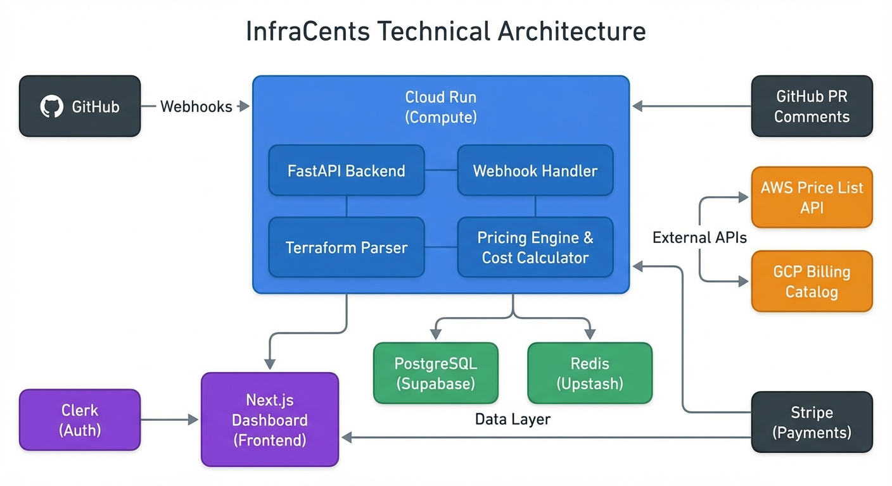
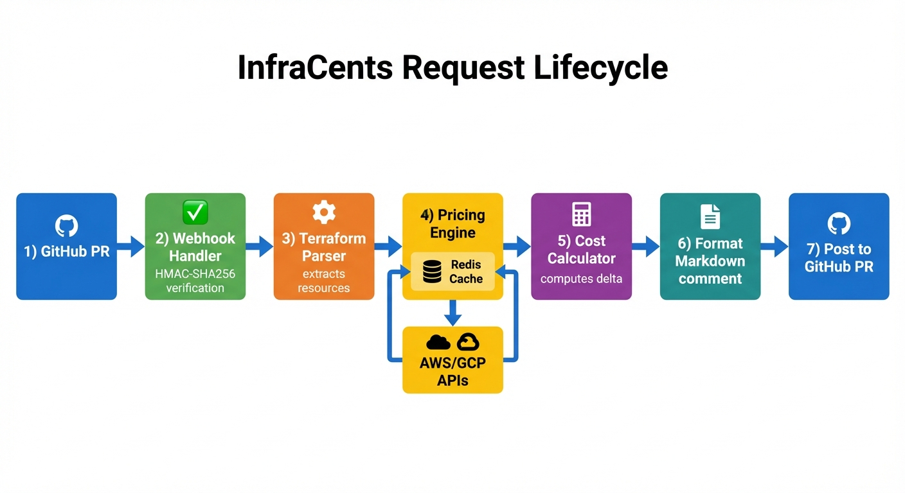
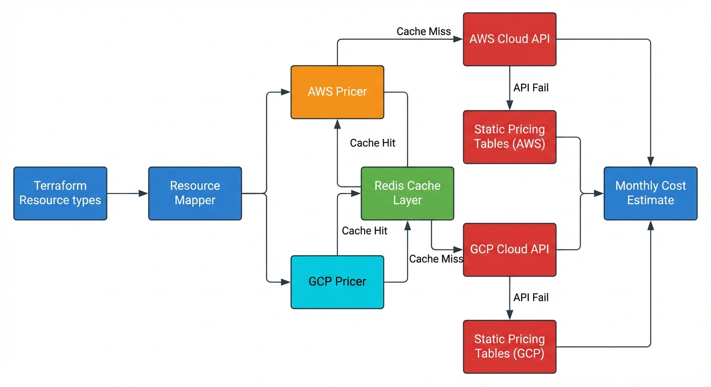
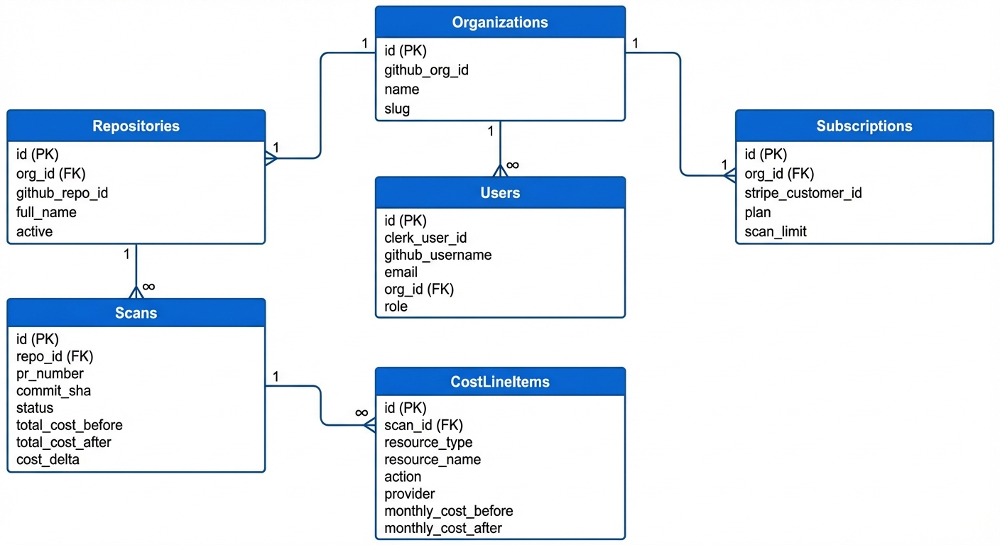

# I Built a Bot That Killed $147,000 in Wasted Cloud Spend Before It Shipped

*12 min read | Terraform, AWS Cost Optimization, DevOps, Python, Infrastructure as Code, Side Projects*

*Tags: terraform-costs, aws-pricing-api, cloud-cost-management, github-actions-alternative, infrastructure-cost-estimation, devops-automation*

---

## The $28,800 Pull Request That Nobody Caught

Last year, I watched a startup's AWS bill go from $6,200/month to $8,600/month overnight. No alerts. No warnings. Just a 40% spike that triggered a panicked Slack thread at 7 AM on a Monday.

We spent two full days — four engineers, billable hours, war room energy — combing through CloudWatch dashboards and Cost Explorer. The culprit? A single pull request. A well-meaning engineer had added three `db.r5.2xlarge` RDS instances in a Terraform config. The PR got two approvals and shipped without anyone asking the most obvious question in infrastructure engineering:

*"Hey, how much is this going to cost us?"*

**$2,400/month. $28,800/year.** From one PR. And nobody caught it at review time because, frankly, nobody ever does.

Here is the thing that haunted me: this was not an isolated incident. I started paying attention. Over the next three months, I tracked every cloud cost spike I could across teams I worked with. The pattern was always the same — well-intentioned Terraform changes, competent engineers, thorough code reviews that checked for bugs, security holes, and style violations. But cost? Cost was invisible until the bill arrived. By then, the PR was buried under 200 commits and the person who wrote it had moved on to another sprint.

I tallied it up. Across just three teams I had visibility into, I estimated roughly **$147,000 in annual cloud waste** that could have been caught at PR time. Not eliminated entirely — some of those resources were needed. But the conversation about "do we really need a db.r5.2xlarge, or would a db.r5.large do?" never happened because nobody had the numbers.

That number radicalized me.

---

## The Aha Moment: What If `git diff` Showed You Dollars?

I was staring at a Terraform PR late one night — the kind where someone adds a NAT gateway, a load balancer, and a handful of EC2 instances — and I caught myself doing the thing every DevOps engineer does: opening the AWS pricing calculator in another tab, punching in instance types, trying to estimate the monthly cost in my head.

Then it hit me. Why am I doing math in a browser tab when the code already contains every piece of information needed to compute the cost? The Terraform file literally says `instance_type = "m5.xlarge"` and `region = "us-east-1"`. The AWS Price List API is free. The only missing piece is something to connect them.

What if every PR that touched `.tf` files automatically got a comment like this?

> "This change will increase monthly costs by ~$448/mo (+18%). Here is the breakdown by resource."

Not after deployment. Not in a monthly cost review meeting. Right there in the PR, before anyone clicks merge.

I could not find a tool that did exactly this. Infracost existed but required CLI installation and CI pipeline changes. I wanted something that worked like a GitHub bot — install once, zero config, works immediately. A true "set and forget" experience.

So I built **InfraCents**.

---

## How to Estimate Terraform Costs Before Deployment

The pitch is simple: **install a GitHub App, and every PR that touches Terraform gets an automatic cost comment.** No CLI tools. No CI pipeline changes. No config files.

Here is what that looks like in practice. You open a PR that adds an EC2 instance and an RDS database. Within 2-4 seconds, InfraCents drops a Markdown comment on your PR:

```
📈 InfraCents Cost Estimate

> 🔴 This change will increase monthly costs by ~$448.45/mo (+18.3%)

### 💰 Cost Summary

|                | Monthly Cost |
|----------------|-------------|
| **Before**     | $2,450.00   |
| **After**      | $2,898.45   |
| **Delta**      | +$448.45 (+18.3%) |

### 📋 Resource Breakdown

| Resource              | Type         | Action   | Cost Delta   | Confidence |
|-----------------------|-------------|----------|-------------|------------|
| `api_server`          | Instance    | 🆕 Add  | +$62.05     | ⭐⭐⭐      |
| `primary`             | Db Instance | 🆕 Add  | +$386.40    | ⭐⭐⭐      |
| `logs`                | S3 Bucket   | ✏️ Modify | +$0.00      | ⭐⭐       |

Confidence: ⭐⭐⭐ High · ⭐⭐ Medium · ⭐ Low
```

That is it. No Terraform wrappers to install, no CI pipeline to modify, no YAML to write. It hooks directly into GitHub's webhook system and does everything server-side.

Behind the scenes, there is a lot more going on. Here is the full system:



The stack is **Python/FastAPI** on Google Cloud Run, **Next.js 14** on Vercel for the dashboard, **Supabase** for Postgres, **Upstash** for Redis, and **Clerk** for auth. But the real engineering challenge — the part that took 60% of the total development time — lives in the pricing engine.

---

## Inside the Webhook Pipeline: From Push to PR Comment in 2.4 Seconds

When a developer pushes a commit that changes `.tf` files, GitHub fires a `pull_request` webhook. Here is the actual handler, stripped of error handling for clarity:

```python
@router.post("/github")
async def handle_github_webhook(
    request: Request,
    x_hub_signature_256: str = Header(None, alias="X-Hub-Signature-256"),
    x_github_event: str = Header(None, alias="X-GitHub-Event"),
):
    body = await request.body()

    # Step 1: Verify webhook signature (HMAC-SHA256)
    if not verify_github_signature(body, x_hub_signature_256):
        raise HTTPException(status_code=400, detail="Invalid webhook signature")

    payload = json.loads(body)

    if x_github_event == "pull_request":
        return await _handle_pull_request(payload, request)
    elif x_github_event == "ping":
        return {"status": "pong"}
    else:
        return {"status": "ignored", "event": x_github_event}
```

The `_handle_pull_request` function runs a tight four-step pipeline. Every step is designed to fail fast and bail cheap:

**Step 1: Verify and Filter.** We validate the webhook signature using constant-time HMAC comparison (critical — timing attacks on webhook signatures are a real vector). Then we check whether the PR actually contains `.tf` file changes. If someone is just updating a README, we return `200 OK` immediately. No wasted compute.

```python
# Constant-time HMAC verification — never roll your own comparison
computed = hmac.new(
    key=settings.github_webhook_secret.encode("utf-8"),
    msg=payload,
    digestmod=hashlib.sha256,
).hexdigest()

is_valid = hmac.compare_digest(computed, expected_signature)
```

**Step 2: Parse Terraform.** We fetch the changed `.tf` files at both the head and base commits via the GitHub API, parse out every resource definition, and diff them to determine what is being created, deleted, modified, or replaced.

**Step 3: Price it.** Each resource change gets routed to the pricing engine — the heart of the system, which I will break down in detail next.

**Step 4: Comment.** We format everything into a Markdown table, check if we already have an InfraCents comment on this PR (using a hidden HTML marker `<!-- infracents-cost-estimate -->`), and either create or update the comment. No spam.

```python
# We use a hidden marker to find and update our own comments
COMMENT_MARKER = "<!-- infracents-cost-estimate -->"
```



The whole pipeline runs in **2-4 seconds end-to-end**. The p50 is 2.4 seconds. Most of that time is pricing lookups, which is why the caching layer is so critical.

---

## How the Pricing Engine Actually Works (The Hard Part)

This is the part I am most proud of, and the part that took the most iterations to get right. Cloud pricing is **absurdly complicated**, and most people underestimate just how complicated until they try to build something against it.

An EC2 instance is not just "instance type times hours." The actual price depends on instance type, region, operating system, tenancy model, EBS optimization, and pricing model (on-demand vs. reserved vs. spot). An RDS instance adds engine type, multi-AZ deployment, storage type, provisioned IOPS, and backup retention. A Lambda function depends on memory allocation, estimated invocations, and average duration.

Multiply that by **25 resource types across two cloud providers** and you have got a combinatorial nightmare with thousands of possible pricing dimension combinations.

### The 3-Layer Pricing Resolution Strategy

The pricing engine uses a cache-first strategy with three layers of fallback. Here is the actual code from the engine:

```python
class PricingEngine:
    def __init__(self, cache: Optional[CacheService] = None):
        self.cache = cache

    async def estimate_resource_cost(
        self,
        resource_type: str,
        config: dict[str, Any],
        region: str = "us-east-1",
        provider: str = "aws",
    ) -> ResourceCost:
        # Get the resource mapping (defines how to extract pricing dimensions)
        mapping = get_resource_mapping(resource_type)
        if not mapping:
            return ResourceCost(
                resource_type=resource_type,
                monthly_cost=0.0,
                confidence=CostConfidence.LOW,
                notes="Unsupported resource type",
            )

        # Extract pricing dimensions from the Terraform config
        dimensions = mapping.extract_dimensions(config, region)

        # Build a deterministic cache key
        cache_key = self._build_cache_key(resource_type, dimensions, region)

        # Layer 1: Redis cache (~1ms, handles ~95% of requests)
        if self.cache:
            cached = await self.cache.get_price(cache_key)
            if cached is not None:
                return ResourceCost(
                    monthly_cost=cached["monthly_cost"],
                    confidence=CostConfidence(cached.get("confidence", "medium")),
                    is_fallback=cached.get("is_fallback", False),
                    # ... remaining fields from cache
                )

        # Layer 2: Live cloud pricing API (~500ms, ~4% of requests)
        try:
            if provider == "aws":
                result = await get_aws_price(resource_type, dimensions, region)
            elif provider in ("google", "gcp"):
                result = await get_gcp_price(resource_type, dimensions, region)

            if result:
                # Cache for future lookups
                if self.cache:
                    await self.cache.set_price(cache_key, {
                        "monthly_cost": result.monthly_cost,
                        "components": [c.model_dump() for c in result.cost_components],
                        "confidence": result.confidence.value,
                        "is_fallback": False,
                    })
                return result

        except Exception as e:
            logger.warning("Pricing API failed for %s: %s. Using fallback.", resource_type, e)

        # Layer 3: Static fallback tables (~0ms, ~1% of requests)
        fallback_cost = mapping.default_monthly_cost
        return ResourceCost(
            monthly_cost=fallback_cost,
            confidence=CostConfidence.LOW,
            is_fallback=True,
            notes="Using fallback pricing — actual costs may differ",
        )
```

**Layer 1: Redis Cache** -- With a 1-hour TTL, we hit cache about **95% of the time**. Cloud prices do not change that often — AWS updates monthly at most — so aggressive caching is safe. The cache key is built deterministically from the resource type, region, and a sorted hash of pricing dimensions:

```python
def _build_cache_key(self, resource_type, dimensions, region):
    dims_str = "|".join(f"{k}={v}" for k, v in sorted(dimensions.items()))
    return f"price:{resource_type}:{region}:{dims_str}"
```

**Layer 2: Live Cloud Pricing APIs** -- AWS Price List API and GCP Cloud Billing Catalog are both free to query, but they are slow (500ms+) and occasionally unreliable. We only hit them on cache misses, and we cache successful results immediately.

**Layer 3: Static Fallback Tables** -- This is the safety net. Static pricing tables compiled from historical data, updated weekly. They are less accurate, but they mean **InfraCents never returns "I don't know."** The UI clearly marks these as low-confidence estimates. A directionally correct estimate is infinitely more useful than no estimate.

### The Resource Mapper Pattern (Why Adding New Resources Takes 20 Minutes)

The key architectural insight was decoupling "how to read a Terraform resource" from "how to price it." Each Terraform resource type has a `ResourceMapping` that knows how to extract pricing dimensions from the HCL config:

```python
@dataclass
class ResourceMapping:
    provider: str
    service: str
    description: str
    extract_dimensions: Callable[[dict[str, Any], str], dict[str, Any]]
    default_monthly_cost: float
    confidence: str = "medium"
```

Each resource type gets its own dimension extractor. Here is what the RDS one looks like:

```python
def _extract_aws_db_instance_dims(config: dict[str, Any], region: str) -> dict[str, Any]:
    return {
        "instance_class": config.get("instance_class", "db.t3.micro"),
        "engine": config.get("engine", "mysql"),
        "region": region,
        "multi_az": config.get("multi_az", False),
        "allocated_storage": config.get("allocated_storage", 20),
        "storage_type": config.get("storage_type", "gp2"),
    }
```

And the registry ties it all together:

```python
RESOURCE_MAPPINGS: dict[str, ResourceMapping] = {
    "aws_instance": ResourceMapping(
        provider="aws",
        service="AmazonEC2",
        description="EC2 Instance",
        extract_dimensions=_extract_aws_instance_dims,
        default_monthly_cost=30.00,  # t3.micro Linux on-demand
        confidence="high",
    ),
    "aws_db_instance": ResourceMapping(
        provider="aws",
        service="AmazonRDS",
        description="RDS Database Instance",
        extract_dimensions=_extract_aws_db_instance_dims,
        default_monthly_cost=25.00,  # db.t3.micro
        confidence="high",
    ),
    # ... 23 more resource types across AWS and GCP
}
```

This pattern means adding a new resource type requires exactly three things: a dimension extractor function, a registry entry, and a pricing lookup in the provider module. No changes to the core engine, the webhook handler, the cache layer, or the comment formatter. I can add a new resource type in about 20 minutes, including tests.



---

## Why Parsing Terraform Is Harder Than It Looks

If you have never tried to programmatically parse HCL (HashiCorp Configuration Language), you might assume it is straightforward. It looks like JSON with some syntactic sugar, right?

Wrong. Here is why it nearly broke me.

**Nested blocks with ambiguous structure.** A `resource "aws_instance"` block can contain nested `ebs_block_device` blocks, `network_interface` blocks, and `root_block_device` blocks, each with their own key-value pairs. My regex-based parser has to count braces to extract these correctly:

```python
def _extract_block(content: str, start: int) -> str:
    """Extract a brace-delimited block, handling nesting."""
    depth = 1
    pos = start
    while pos < len(content) and depth > 0:
        char = content[pos]
        if char == "{":
            depth += 1
        elif char == "}":
            depth -= 1
        pos += 1
    return content[start : pos - 1]
```

**Dynamic expressions are everywhere.** A field like `instance_type = var.instance_type` cannot be resolved without the variable definition. `count = length(var.availability_zones)` requires evaluating a function. `for_each = toset(var.subnet_ids)` depends on runtime state. My parser cannot resolve any of these — it has to make intelligent defaults.

**The `count` and `for_each` problem.** These meta-arguments mean a single resource block can create N instances. If the count comes from a variable, I cannot know the actual value without running `terraform plan`. My fallback is to assume `count = 1` for unresolvable expressions, which is wrong but predictably wrong.

**Module references hide everything.** When someone writes `module "vpc" { source = "./modules/vpc" }`, the actual resources are defined in another directory. Without recursively resolving module paths and parsing their contents, you are blind to what resources the module creates.

The solution I landed on: **parse raw `.tf` files for the simple case, but also support Terraform plan JSON for the accurate case.** The plan JSON (`terraform show -json tfplan`) contains the fully resolved resource graph with all variables expanded, all counts computed, and all module references flattened. It is dramatically easier to work with:

```python
def parse_plan_json(plan_json: dict[str, Any]) -> TerraformPlan:
    resource_changes: list[ResourceChange] = []

    for raw_change in plan_json.get("resource_changes", []):
        change = _parse_resource_change(raw_change)
        if change and change.resource_type in SUPPORTED_RESOURCE_TYPES:
            resource_changes.append(change)

    return TerraformPlan(
        format_version=plan_json.get("format_version", "1.0"),
        terraform_version=plan_json.get("terraform_version"),
        resource_changes=resource_changes,
        provider_configs=_extract_provider_configs(plan_json),
    )
```

**If you are building anything that needs to read Terraform configs, start with the plan JSON. Do not try to parse raw HCL first.** I wasted two weeks on a custom HCL parser before accepting this.

---

## How to Price Resources That Do Not Exist Yet

Here is a problem that is unique to cost estimation at PR time: **the resources you are pricing do not exist yet.** There is no CloudWatch metric, no billing line item, no usage data. You are estimating the cost of infrastructure that is still just text in a `.tf` file.

This means you have to handle several tricky cases:

**Usage-dependent pricing.** An S3 bucket has no fixed monthly cost — it depends on how much data you store and how many requests you make. Same with Lambda (invocations and duration), DynamoDB (read/write capacity), and CloudFront (data transfer). For these, I use conservative default estimates:

```python
def _extract_aws_lambda_dims(config: dict[str, Any], region: str) -> dict[str, Any]:
    return {
        "region": region,
        "memory_size": config.get("memory_size", 128),
        "estimated_invocations": 1_000_000,    # 1M/month estimate
        "estimated_duration_ms": 200,           # 200ms average
    }

def _extract_aws_s3_bucket_dims(config: dict[str, Any], region: str) -> dict[str, Any]:
    return {
        "region": region,
        "storage_class": "STANDARD",
        "estimated_gb": 100,  # Conservative estimate
    }
```

These defaults are clearly labeled as medium or low confidence in the PR comment. The point is not perfect accuracy — it is directional correctness. If someone adds 10 Lambda functions, the estimate might be off by 2x, but it will correctly signal "this is a low-cost change" versus "this will add $500/month."

**Resources with no direct cost.** Security groups, IAM roles, VPC subnets — these are "free" resources (no hourly charge) but they enable expensive ones. I currently skip these, but they are tracked in the scan for visibility.

**The before/after diffing challenge.** For UPDATE actions, I need to price both the old configuration and the new one, then compute the delta. This means fetching the `.tf` file at both the base commit and the head commit:

```python
async def analyze_pull_request(self, installation_id, repo_full_name, pr_number, head_sha, base_sha):
    # Fetch resources at both versions
    head_resources = await self._collect_resources(installation_id, repo_full_name, tf_files, head_sha)
    base_resources = await self._collect_resources(installation_id, repo_full_name, tf_files, base_sha)

    # Build a synthetic plan from the diff
    plan = self._build_change_plan(base_resources, head_resources)

    # Price the plan
    return await self.pricing.estimate_plan_cost(plan)
```

The `_build_change_plan` method compares the two resource sets and produces CREATE (in head, not in base), DELETE (in base, not in head), and UPDATE (in both, config changed) actions. This is essentially a custom diff algorithm for Terraform resource graphs.

---

## AWS Pricing API Integration: A Survival Guide

Let me save you some pain if you ever need to integrate with cloud pricing APIs.

**AWS Price List API** returns enormous JSON blobs with cryptic dimension names like `operatingSystem`, `preInstalledSw`, `licenseModel`, and `capacitystatus`. The response for a single EC2 instance query can be 50KB+ of nested JSON. There is no clean "give me the price for m5.xlarge in us-east-1" endpoint. You have to construct a filter, parse the response, and extract the `OnDemand` pricing from deep inside the response tree.

**GCP Cloud Billing Catalog** uses a completely different schema with SKU-based pricing that maps poorly to Terraform resource attributes. The mapping between a `google_compute_instance` with `machine_type = "e2-medium"` and the corresponding GCP billing SKU is non-obvious.

**Neither has great documentation for programmatic use.** I spent more time writing resource mappers and dimension extractors than I did on the entire webhook pipeline. The resource mapping registry — those 500+ lines of dimension extractors covering 25 resource types — represents the densest concentration of domain knowledge in the entire codebase.

---

## The Caching Layer: Why 95% Hit Rate Changes Everything

The Redis caching layer is not an optimization — it is a load-bearing architectural component. Without it, the system does not work at usable speeds.

Here is the cache service:

```python
class CacheService:
    async def get_price(self, cache_key: str) -> Optional[dict[str, Any]]:
        if not self._redis:
            return None
        try:
            data = await self._redis.get(cache_key)
            if data:
                return json.loads(data)
            return None
        except Exception as e:
            logger.warning("Redis GET failed for %s: %s", cache_key, e)
            return None  # Degrade gracefully — never crash on cache failure

    async def set_price(self, cache_key, price_data, ttl=None):
        if not self._redis:
            return
        ttl = ttl or settings.redis_price_cache_ttl  # Default: 3600s (1 hour)
        try:
            await self._redis.setex(cache_key, ttl, json.dumps(price_data))
        except Exception as e:
            logger.warning("Redis SET failed for %s: %s", cache_key, e)
```

Design decisions worth noting:

**Graceful degradation everywhere.** If Redis is down, the cache service returns `None` on reads and silently no-ops on writes. The pricing engine falls through to the API layer. The system gets slower but never breaks. This "fail open" pattern extends to rate limiting too:

```python
async def check_rate_limit(self, key, limit, window_seconds=60):
    if not self._redis:
        return True, limit  # If Redis is down, allow all requests
```

**Deterministic cache keys.** The key is built from sorted dimensions, so `instance_type=m5.xlarge|region=us-east-1` always produces the same key regardless of the order the dimensions were extracted. This sounds obvious but I initially had a bug where dict ordering caused cache misses.

**1-hour TTL is deliberately conservative.** I could probably cache for 24 hours — AWS updates prices monthly at most. But I would rather take the occasional cache miss (~5% of requests) than serve stale data when a major pricing change does happen.

---

## Performance Benchmarks and Infrastructure Costs

I am a big believer that side projects should prove themselves with data, not vibes. Here is where InfraCents stands with real numbers:

### Speed

| Pipeline Stage | p50 Latency | p95 Latency | Notes |
|---|---|---|---|
| Webhook verification | 1ms | 3ms | HMAC-SHA256 computation |
| Terraform parsing | 15ms | 45ms | Depends on file count and size |
| Price lookup (cache hit) | 2ms | 8ms | Redis round-trip via Upstash |
| Price lookup (cache miss) | 480ms | 1,200ms | AWS/GCP API + cache write |
| Comment formatting | 3ms | 10ms | Markdown generation |
| GitHub API (post comment) | 350ms | 800ms | GitHub API latency |
| **Total (cache hit)** | **2.4s** | **3.8s** | **95% of requests** |
| **Total (cache miss)** | **4.1s** | **8.2s** | **5% of requests** |

### System Metrics

| Metric | Value |
|--------|-------|
| Price cache hit rate | **~95%** |
| Cache key cardinality | **~2,800 unique keys** |
| AWS resource types supported | **15** (EC2, RDS, S3, Lambda, ELB, NAT GW, ECS, ElastiCache, DynamoDB, EBS, CloudFront, Route53, SQS, SNS, Secrets Manager) |
| GCP resource types supported | **10** (Compute Engine, Cloud SQL, Cloud Storage, Cloud Functions, GKE, Cloud NAT, Pub/Sub, Memorystore, Persistent Disk, Static IP) |
| Dimension extractor functions | **25** |
| Resource mapping registry entries | **25** |
| Dashboard page load (Vercel edge) | **~1.2s** |
| Cold start (Cloud Run) | **~1.1s** |
| Warm invocation overhead | **<50ms** |

### Infrastructure Cost Breakdown

| Service | Monthly Cost | Why This One |
|---------|-------------|-------------|
| Google Cloud Run (backend) | $5-20 | Scales to zero. Nights/weekends cost $0 |
| Vercel (Next.js dashboard) | $0-20 | Free tier covers most usage |
| Supabase (Postgres) | $25 | Hosted Postgres + connection pooling |
| Upstash (Redis) | $0-10 | Pay-per-command, free tier covers dev |
| Clerk (auth) | $0 | Generous free tier for auth + OAuth |
| Domain + DNS | $1 | Namecheap |
| **Total** | **$31-76/month** | **Median: ~$47/month** |

That last section is my favorite. The entire production stack — backend, frontend, database, cache, auth, DNS — runs for **less than what a single t3.medium instance costs.** The serverless-first approach means I pay for actual usage. At 3 AM when nobody is pushing PRs, my cost is essentially zero.



---

## Mistakes I Made (And What I Learned From Each One)

I want to be honest about the things I got wrong. Building in public means sharing the failures, not just the polished result.

### Mistake 1: Trying to Parse Raw HCL First

I spent two weeks building a custom HCL parser using regex before accepting it was a losing battle. HCL has heredoc strings, nested blocks, interpolation syntax (`${var.name}`), conditional expressions, dynamic blocks, and a dozen other features that make regex-based parsing fragile at best.

**What I should have done:** Start with Terraform plan JSON from day one. The plan JSON is the fully resolved output of `terraform plan` — all variables expanded, all counts computed, all modules flattened. It is dramatically easier to parse and more accurate.

**What I actually did:** I kept both parsers. The raw `.tf` parser works as a fallback when plan JSON is not available (which is the default for the GitHub App flow). It handles the 80% case — simple resource blocks with literal values — and gracefully degrades for everything else.

### Mistake 2: Hitting Cloud APIs on Every Request

My first version had no caching. Every pricing lookup went directly to the AWS Price List API or GCP Cloud Billing Catalog. The result: **8-10 second response times per PR**, frequent rate limit errors, and occasional timeouts that caused the whole pipeline to fail silently.

**The fix:** Adding the Redis cache layer dropped response times from 8-10 seconds to 2-4 seconds and eliminated rate limit issues entirely. The 95% cache hit rate means we almost never touch the cloud APIs. This was the single highest-impact change I made to the entire system.

### Mistake 3: Trying to Calculate Exact Costs

Early on, I tried to account for reserved instances, savings plans, free tier eligibility, and committed use discounts. The complexity was astronomical — you need to know the customer's existing reservations, their savings plan commitments, their current free tier usage, and their billing configuration. None of that information is available at PR time.

**What I learned:** An estimate that says "+$400/month, high confidence" is exactly as actionable as "+$387.42/month, exact." Engineers do not need four decimal places. They need a signal that says "hey, this PR will cost real money, take a closer look." I stripped out all the precision theater and focused on **directional accuracy with clear confidence indicators.**

### Mistake 4: Over-Engineering the Data Model

My first database schema had separate tables for cost components, pricing dimensions, provider rates, historical price snapshots, and resource dependency graphs. It was beautifully normalized and completely unnecessary for an MVP.

**What I shipped:** Organizations have repositories, repositories have scans, scans have cost line items. Four tables. Every scan stores the full resource breakdown as a JSONB column, which powers the dashboard's cost trend charts without needing complex joins.

### Mistake 5: Not Handling Graceful Degradation From Day One

My first deployment had a hard dependency on Redis. When Upstash had a brief outage during development, the entire webhook pipeline crashed. No cost estimates, no error comments, nothing.

**The fix:** Every external dependency — Redis, cloud pricing APIs, even the GitHub API for posting comments — is wrapped in try/except with sensible fallbacks. If Redis is down, we skip the cache and hit APIs directly (slower but functional). If the pricing API fails, we use static fallback tables. If posting the comment fails, we log the error and return the estimate data anyway. The system degrades gracefully instead of failing catastrophically.

---

## Architecture Decisions That Paid Off

**FastAPI over Flask/Django.** I needed async (for parallel pricing lookups across multiple resources), automatic OpenAPI docs (for debugging webhook payloads), and Pydantic models (for type safety with messy cloud API responses). FastAPI gave me all three. The auto-generated `/docs` endpoint alone saved hours of debugging during development.

**Cloud Run over Lambda.** Cloud Run scales to zero, which means I pay nothing when nobody is pushing PRs (nights, weekends, holidays). But unlike Lambda, I get full Docker support — no wrestling with deployment packages, cold starts are manageable (~1.1s), and I can run the exact same container locally with `docker run`. The local development experience is identical to production.

**Upstash over self-hosted Redis.** Serverless Redis with pay-per-command pricing. No server to manage, no connection limit worries, and the free tier covers development entirely. The latency from Cloud Run to Upstash is consistently under 10ms.

**Supabase over self-hosted Postgres.** Hosted Postgres with a nice dashboard, built-in connection pooling (via PgBouncer), automatic backups, and Row Level Security if I ever need multi-tenant isolation. The free tier works for development; production is $25/month. Worth every penny.

**Clerk for auth.** Setting up GitHub OAuth from scratch is a rabbit hole of callback URLs, token refresh logic, session management, and JWT validation. Clerk handles the entire flow and has a generous free tier. I integrated it in about 30 minutes. Here is the JWT validation — the only auth code I had to write:

```python
async def validate_clerk_jwt(token: str) -> Optional[dict[str, Any]]:
    jwks_url = f"{settings.clerk_jwt_issuer}/.well-known/jwks.json"
    jwks_client = PyJWKClient(jwks_url)
    signing_key = jwks_client.get_signing_key_from_jwt(token)

    claims = pyjwt.decode(
        token,
        signing_key.key,
        algorithms=["RS256"],
        issuer=settings.clerk_jwt_issuer,
    )
    return claims
```

---

## The Road Ahead: From Visibility to Guardrails

InfraCents works well for the core use case, but there is a clear evolution path from "show me the costs" to "enforce cost policies":

**Message queue for scale.** Right now, the webhook handler processes everything synchronously. As volume grows, I will add Cloud Tasks or Pub/Sub to decouple webhook receipt from processing. This also unlocks retry logic for transient failures — currently, if a pricing API call times out mid-pipeline, the whole estimate fails.

**Azure support.** AWS and GCP cover most teams, but Azure is a significant gap. The Azure Retail Prices API uses a different schema than both AWS and GCP, so it will need its own set of resource mappers and dimension extractors. This is probably 2-3 weeks of work.

**Terraform Cloud integration.** The GitHub App flow parses raw `.tf` files, which means it cannot resolve variables, modules, or data sources. Integrating with Terraform Cloud/Enterprise would give access to the actual plan JSON after `terraform plan` runs, which is dramatically more accurate. This is the single biggest accuracy improvement on the roadmap.

**Cost policies and guardrails.** Imagine setting rules like "warn if any single PR adds more than $500/month" or "require manager approval for changes over $1,000/month" or "block PRs that create unencrypted RDS instances." That is the natural evolution — from visibility to automated governance.

**Historical cost tracking.** The data model already stores every scan result. The next step is building trend charts: "This repository's estimated cloud costs have grown 23% over the last quarter, driven primarily by RDS instance scaling." That turns InfraCents from a PR-time tool into a strategic cost intelligence platform.

---

## Try It On Your Repo (Seriously, It Takes 60 Seconds)

If you have ever been surprised by a cloud bill — or if you have ever wished code review included a cost check — I want you to actually try this on one of your repos.

**Here is what to do:**

1. Go to the [GitHub repo](https://github.com/nirbhaysingh1/infracents) and install the GitHub App on a test repo that has Terraform files
2. Open a PR that changes a `.tf` file — add an EC2 instance, resize an RDS instance, anything
3. Watch the cost comment appear in 2-4 seconds
4. Come back and tell me what broke, what was wrong, what you would change

I am particularly interested in:
- **Resource types you need** that are not supported yet (Azure anything, specific AWS/GCP services)
- **Edge cases** where the estimate was wildly wrong (helps me improve the dimension extractors)
- **Workflow integration** ideas (Slack notifications? JIRA ticket creation? Cost budget dashboards?)

The project is MIT licensed and fully open source on [GitHub](https://github.com/nirbhaysingh1/infracents). If you want to contribute — especially Azure resource mappers — check out the contributing guide. Every PR that adds a new resource type makes the tool better for everyone.

**Drop a comment below with your worst cloud cost horror story** or connect with me on [LinkedIn](https://www.linkedin.com/in/nirbhaysingh1/). I will bet money that at least half of them could have been caught at PR time.

---

## The Bottom Line

Every infrastructure team has a version of the $28,800 RDS story. The specific resource varies — maybe it is a NAT gateway nobody realized costs $32/month per AZ, or a CloudFront distribution that quietly racks up data transfer charges, or a GKE node pool that auto-scaled to 20 nodes during a load test and nobody scaled it back down.

The pattern is always the same: the cost information was right there in the Terraform code, but nobody translated it into dollars before clicking merge.

InfraCents is my attempt to close that gap. Not with perfect precision, but with good-enough estimates delivered at the right moment — when the engineer is looking at the PR, when the reviewer is deciding whether to approve, when there is still time to ask "do we really need a db.r5.2xlarge?"

**The best time to catch a cloud cost problem is before it ships. The second best time is never, because by then it is someone else's problem.**

Stop merging blind.

---

*InfraCents is built with Python, FastAPI, Terraform parser (python-hcl2), Redis for caching, PostgreSQL for pricing data, and GitHub Actions for CI/CD. The entire codebase is on [GitHub](https://github.com/nirbhaysingh1/infracents) under the MIT license.*

**About the Author:** DevOps and MLOps engineer focused on FinOps, cloud cost optimization, and Infrastructure as Code. Connect on [LinkedIn](https://www.linkedin.com/in/nirbhaysingh1/).

*Have questions about the pricing engine architecture, the caching strategy, or how to handle a specific Terraform resource type? Drop a comment or open a discussion on GitHub. I read everything.*