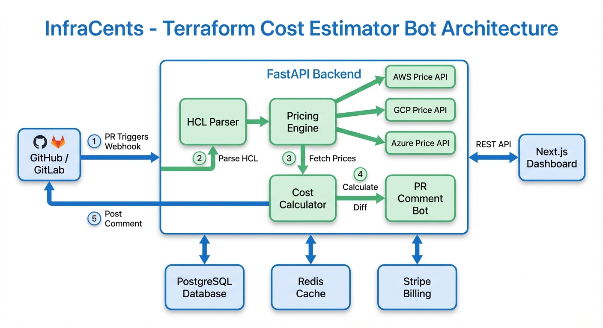
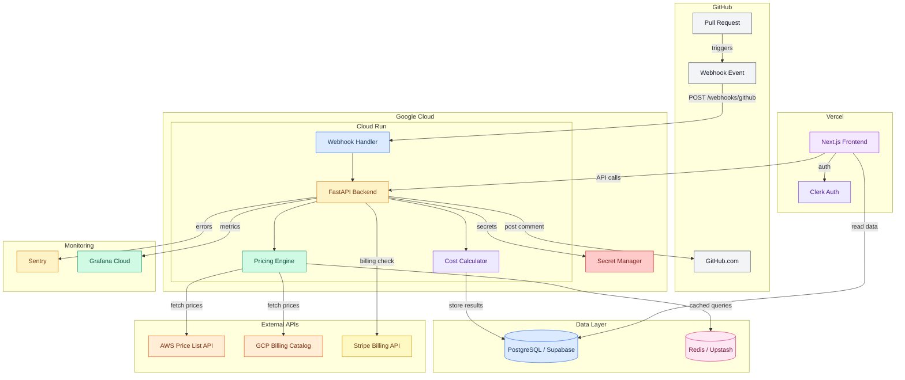
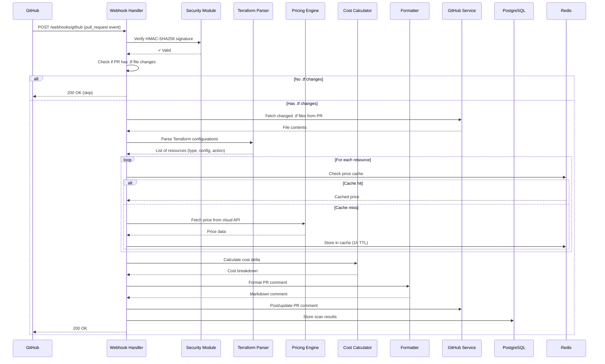
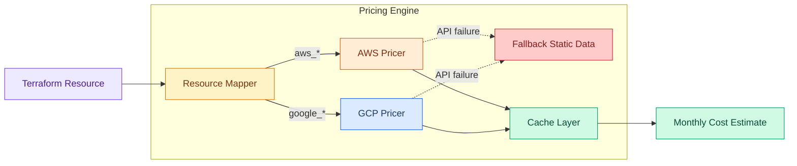
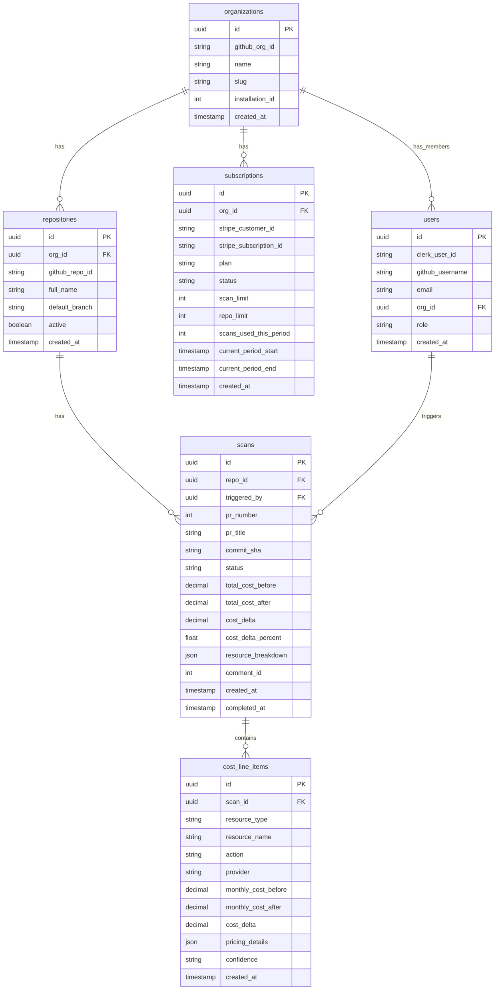
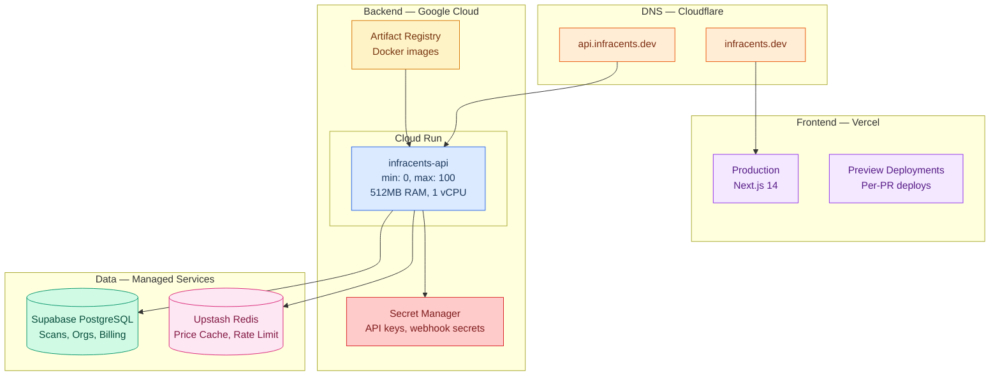
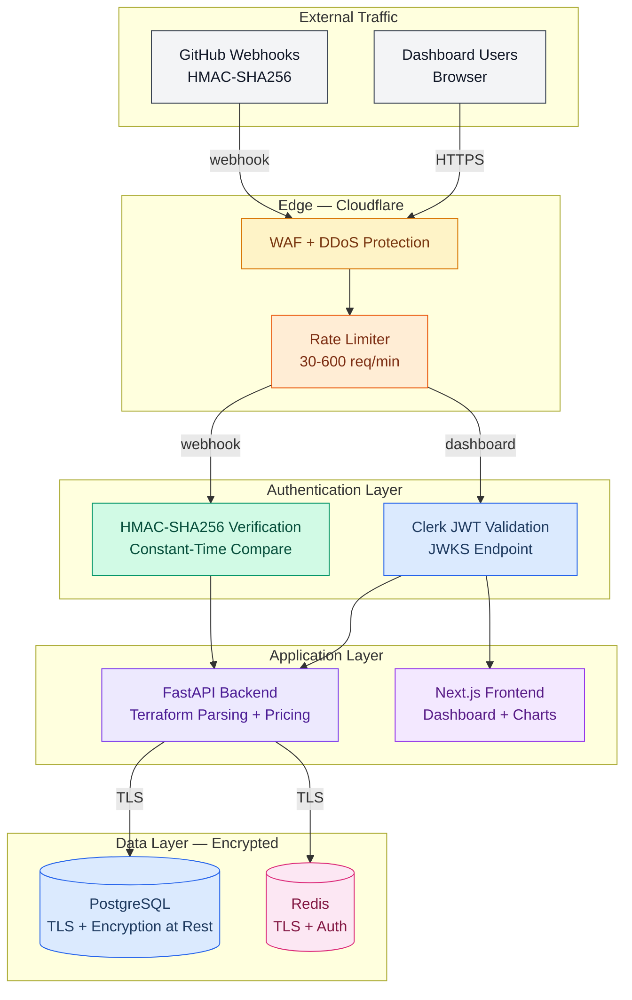

# Architecture

## Overview

InfraCents is a distributed system designed for **high availability**, **low latency**, and **cost efficiency**. The architecture follows a serverless-first approach, meaning every component scales to zero when idle and scales up automatically under load.

---

## System Architecture Diagram




---

## Component Architecture

### 1. Webhook Handler (Entry Point)



### 2. Pricing Engine

The pricing engine is the core intellectual property of InfraCents. It abstracts away the complexity of cloud pricing APIs and provides a unified interface for cost estimation.



**Key Design Decisions:**

| Decision | Rationale |
|----------|-----------|
| Redis caching with 1h TTL | Cloud prices change infrequently; caching reduces API calls by ~95% |
| Static fallback tables | Ensures estimates always return, even if cloud APIs are down |
| Resource mapper pattern | Decouples Terraform resource types from pricing API specifics |
| Per-resource pricing | Allows granular cost breakdown in PR comments |

### 3. Data Model



### 4. Frontend Architecture

```mermaid
graph TB
    subgraph "Next.js App Router"
        LAYOUT[Root Layout + Clerk Provider]

        subgraph "Public Pages"
            LANDING[/ - Landing Page]
        end

        subgraph "Protected Pages"
            DASH[/dashboard - Org Overview]
            REPO[/dashboard/[repo] - Repo Detail]
            SETTINGS[/dashboard/settings - Settings]
        end

        subgraph "API Routes"
            API_PROXY[/api/* - Backend Proxy]
        end
    end

    subgraph "Components"
        NAV[Navbar]
        FOOTER[Footer]
        CHART[CostChart - Recharts]
        TABLE[PRCostTable]
        PRICING[PricingCard]
    end

    LAYOUT --> LANDING
    LAYOUT --> DASH
    LAYOUT --> REPO
    LAYOUT --> SETTINGS
    LAYOUT --> NAV
    LAYOUT --> FOOTER

    DASH --> CHART
    DASH --> TABLE
    REPO --> CHART
    REPO --> TABLE
    LANDING --> PRICING

    style LAYOUT fill:#ede9fe,stroke:#7c3aed,color:#4c1d95
    style LANDING fill:#f3f4f6,stroke:#374151,color:#111827
    style DASH fill:#dbeafe,stroke:#2563eb,color:#1e3a5f
    style REPO fill:#dbeafe,stroke:#2563eb,color:#1e3a5f
    style SETTINGS fill:#dbeafe,stroke:#2563eb,color:#1e3a5f
    style API_PROXY fill:#fef3c7,stroke:#d97706,color:#78350f
    style NAV fill:#d1fae5,stroke:#059669,color:#064e3b
    style FOOTER fill:#d1fae5,stroke:#059669,color:#064e3b
    style CHART fill:#fce7f3,stroke:#db2777,color:#831843
    style TABLE fill:#fce7f3,stroke:#db2777,color:#831843
    style PRICING fill:#ffedd5,stroke:#ea580c,color:#7c2d12
```

---

## Request Flow

### PR Webhook Flow (Critical Path)

```
1. GitHub sends POST /webhooks/github
   └─ Headers: X-Hub-Signature-256, X-GitHub-Event
   └─ Body: pull_request event payload

2. Security verification (< 1ms)
   └─ HMAC-SHA256 signature check
   └─ Event type validation

3. File change detection (< 100ms)
   └─ Check if PR files include *.tf
   └─ If no .tf files → return 200 (skip)

4. Billing check (< 50ms)
   └─ Look up org subscription
   └─ Check scan count against limit
   └─ If over limit → post "upgrade" comment, return 200

5. Terraform parsing (< 500ms)
   └─ Fetch .tf files from GitHub API
   └─ Parse HCL/JSON into resource list
   └─ Identify resource actions (create/update/delete)

6. Price resolution (< 2s typical, cached)
   └─ For each resource:
       └─ Check Redis cache
       └─ If miss: query AWS/GCP pricing API
       └─ Map resource config to pricing dimensions
       └─ Calculate monthly cost

7. Cost calculation (< 100ms)
   └─ Sum costs by action type
   └─ Calculate delta and percentage
   └─ Generate per-resource breakdown

8. Comment posting (< 500ms)
   └─ Format Markdown comment
   └─ Check for existing InfraCents comment
   └─ Create or update PR comment

9. Data persistence (async, < 200ms)
   └─ Store scan record in PostgreSQL
   └─ Store line items
   └─ Update scan count for billing

Total typical latency: 2-4 seconds
```

### Dashboard Request Flow

```
1. User navigates to dashboard
   └─ Clerk middleware checks authentication
   └─ Redirect to login if not authenticated

2. Frontend makes API call to backend
   └─ Authorization header with Clerk JWT
   └─ Backend validates JWT and extracts org_id

3. Backend queries PostgreSQL
   └─ Aggregate cost data by time period
   └─ Join with repository and scan data
   └─ Return paginated results

4. Frontend renders charts and tables
   └─ Recharts for cost trend visualization
   └─ Sortable/filterable PR cost table
```

---

## Deployment Architecture



### Scaling Characteristics

| Component | Min Instances | Max Instances | Scale Trigger |
|-----------|---------------|---------------|---------------|
| Cloud Run | 0 | 100 | Concurrent requests |
| Vercel | Edge (always on) | Auto | Traffic |
| Supabase | 1 | 1 (scale plan) | N/A |
| Upstash Redis | Serverless | Auto | Commands/sec |

### Cost Optimization

- **Cloud Run scales to zero**: No cost when no webhooks are being processed
- **Vercel free tier**: Sufficient for most dashboard traffic
- **Redis caching**: Reduces expensive cloud API calls by ~95%
- **Async processing**: Non-critical tasks (analytics, billing updates) are processed asynchronously

---

## Security Architecture



See [docs/SECURITY.md](SECURITY.md) for the full security model and threat analysis.

---

## Technology Choices

| Technology | Why We Chose It | Alternatives Considered |
|------------|----------------|------------------------|
| **FastAPI** | Async Python, auto-docs, type safety, fast | Flask, Django, Express.js |
| **Next.js 14** | App Router, RSC, Vercel integration, great DX | Remix, SvelteKit, Astro |
| **PostgreSQL** | ACID compliance, JSON support, Supabase hosting | MySQL, MongoDB |
| **Redis** | Fast caching, Upstash serverless support | Memcached, DynamoDB |
| **Cloud Run** | Scales to zero, Docker support, pay-per-use | AWS Lambda, Fly.io |
| **Clerk** | GitHub OAuth, easy setup, generous free tier | Auth0, NextAuth, Supabase Auth |
| **Stripe** | Industry standard, great API, billing support | Paddle, LemonSqueezy |
| **Terraform** | Meta (we use TF to deploy a TF tool), IaC standard | Pulumi, CDK |

---

## Performance Targets

| Metric | Target | Current |
|--------|--------|---------|
| Webhook processing time | < 5s p95 | ~3s |
| Dashboard page load | < 2s | ~1.5s |
| Price cache hit rate | > 90% | ~95% |
| Uptime | 99.9% | N/A (pre-launch) |
| Error rate | < 0.1% | N/A (pre-launch) |

---

## Future Architecture Considerations

1. **Message Queue**: As volume grows, introduce a message queue (Cloud Tasks or Pub/Sub) between the webhook handler and the processing pipeline to handle bursts
2. **Dedicated Workers**: Separate the pricing engine into its own service for independent scaling
3. **GraphQL**: Consider a GraphQL API for the dashboard to reduce over-fetching
4. **Multi-Region**: Deploy Cloud Run in multiple regions for lower latency
5. **Terraform Cloud Integration**: Direct integration with Terraform Cloud/Enterprise for plan JSON access

---

## Failure Modes & Resilience

InfraCents is designed with the assumption that every external dependency **will** fail. The system degrades gracefully: the core function (posting a cost estimate on a PR) is preserved as long as possible, while non-critical features (dashboard, analytics, historical storage) are allowed to degrade independently.

### Redis Failure (Cache Layer)

**Scenario:** Upstash Redis becomes unreachable or returns errors.

- **Detection:** Connection timeout (500ms) or error response on any cache read/write.
- **Fallback:** The pricing engine bypasses the cache entirely and makes direct calls to the AWS Price List API / GCP Billing Catalog. This is functionally transparent to the user.
- **Impact:** Webhook processing latency increases from ~3s to ~5-8s (API calls are uncached). No data loss. No user-visible error.
- **Recovery:** Automatic. Once Redis is reachable again, the cache repopulates organically as new pricing queries execute. No manual intervention required.
- **Circuit breaker:** After 5 consecutive Redis failures within 30 seconds, the cache layer is bypassed entirely for 60 seconds before retrying. This prevents cascading timeouts from slowing down every request.

### GitHub API Outage

**Scenario:** GitHub's API returns 5xx errors or is unreachable. This affects two operations: fetching `.tf` file contents from PRs and posting cost estimate comments.

- **Webhook retry with exponential backoff:** GitHub itself retries webhook deliveries, but for _our_ outbound calls (fetching files, posting comments), InfraCents implements exponential backoff: **1s, 2s, 4s, 8s, 16s, 32s, max 60s**. Maximum 10 retries per webhook event.
- **Dead letter queue:** After all retries are exhausted, the failed webhook payload is written to a `dead_letter_webhooks` table in PostgreSQL with the original payload, error details, retry count, and timestamp. A background job processes the dead letter queue every 5 minutes.
- **Idempotency:** Retried webhooks are safe because comment posting uses upsert logic (find existing InfraCents comment by bot signature, update if exists, create if not).
- **Impact:** PR comments are delayed but eventually posted. Dashboard remains fully functional with existing data.
- **Recovery time:** Dependent on GitHub. Typically resolves within minutes. Dead letter queue ensures nothing is permanently lost.

### Pricing API Unavailability

**Scenario:** AWS Price List API or GCP Billing Catalog returns errors or is unreachable.

- **Layer 1 - Extended cache TTL:** Under normal operation, pricing cache TTL is **1 hour**. When a pricing API returns an error, the cache TTL for that provider is automatically extended to **24 hours**. Stale pricing data is vastly preferable to no pricing data.
- **Layer 2 - Static fallback tables:** If the cache is also empty (cold start + API failure), the pricing engine falls back to **static pricing tables** bundled with the application. These tables contain the most common resource types (EC2, RDS, S3, Cloud Run, GCE, Cloud SQL) at list prices. Updated with each deployment.
- **Layer 3 - Confidence degradation:** When using fallback pricing, the `confidence` field on `cost_line_items` is set to `"low"` instead of `"high"`, and the PR comment includes a disclaimer: _"Some prices are estimated from cached/fallback data and may not reflect current pricing."_
- **Impact:** Cost estimates are still posted. Accuracy may be slightly reduced for uncommon resource types. Users are informed via confidence indicators.
- **Recovery:** Automatic. Next successful API call repopulates the cache at normal TTL.

### Database Outage (Supabase PostgreSQL)

**Scenario:** Supabase PostgreSQL is unreachable or returning errors.

- **Core function preserved:** The webhook handler can still fetch files from GitHub, calculate costs (Redis + pricing APIs), and **post PR comments**. The database is only needed for: storing scan results, checking billing/subscription limits, and serving the dashboard.
- **Billing check bypass:** If the database is unreachable, the billing check is **skipped with a permissive default** (allow the scan). It is better to give a free scan than to block a paying customer. Scan counts are reconciled when the database recovers.
- **Dashboard degradation:** The frontend dashboard shows a "Data temporarily unavailable" banner. Charts and tables display the last successfully loaded data (client-side cache via SWR/React Query stale-while-revalidate).
- **Scan result buffering:** Failed database writes are buffered in-memory (up to 100 scan results) and retried with exponential backoff. If the buffer fills, the oldest entries are written to Cloud Logging as a last-resort audit trail.
- **Impact:** PR comments still work. Dashboard is degraded. Billing enforcement is temporarily relaxed.
- **Recovery time:** Supabase typically recovers within minutes. Buffered scan results are flushed on recovery.

### Cloud Run Cold Starts

**Scenario:** A webhook arrives when no Cloud Run instances are warm. Cold start adds 2-5 seconds to the first request.

- **Pre-warming strategy:** A Cloud Scheduler job sends a lightweight `GET /health` request every 5 minutes to keep at least one instance warm during business hours (6 AM - 10 PM UTC, Monday-Friday).
- **Production configuration:** `min-instances = 1` in production to guarantee at least one warm instance at all times. This costs approximately $5-10/month but eliminates cold starts for the first concurrent request.
- **Startup optimization:** The Docker image uses a multi-stage build with dependencies pre-installed. Application startup time is under 2 seconds (FastAPI + uvicorn).
- **Impact without mitigation:** First webhook after idle period takes 5-8 seconds instead of 2-4 seconds. Subsequent requests are normal.
- **Impact with mitigation:** Negligible. The always-warm instance handles the request while additional instances scale up for concurrent load.

### Webhook Replay Storms

**Scenario:** GitHub re-delivers a batch of webhooks (e.g., after a GitHub outage recovery), or a misconfigured integration sends duplicate events.

- **Idempotency key:** Every webhook is deduplicated using a composite key: `{repo_id}:{pr_number}:{commit_sha}`. If a scan for this exact combination already exists and completed successfully, the webhook is acknowledged with `200 OK` and no processing occurs.
- **Deduplication window:** The idempotency check covers the last **24 hours** of scan records. Events older than 24 hours are treated as new (this handles the edge case of force-pushed commits reusing a SHA, which is astronomically unlikely but theoretically possible).
- **Rate limiting:** Webhooks from a single organization are rate-limited to **30 events per minute**. Excess events are queued (not dropped) and processed at a controlled rate.
- **Impact:** No duplicate PR comments, no duplicate scan records, no wasted compute. Excess events are handled gracefully.

### Failure Mode Matrix

| Component | Failure Type | User Impact | Recovery Time | Mitigation |
|-----------|-------------|-------------|---------------|------------|
| **Redis (Upstash)** | Connection timeout | Slower responses (~5-8s vs ~3s) | Automatic (seconds) | Direct API fallback, circuit breaker |
| **Redis (Upstash)** | Data corruption/eviction | None (cache miss = API call) | Automatic | Cache repopulates organically |
| **GitHub API** | 5xx errors | PR comments delayed | Minutes (GitHub-dependent) | Exponential backoff, dead letter queue |
| **GitHub API** | Rate limiting (403) | PR comments delayed | Up to 1 hour | Rate limit tracking, request queuing |
| **AWS Price List API** | Unavailable | Slightly stale pricing | Automatic | Extended cache TTL (24h), static fallback |
| **GCP Billing API** | Unavailable | Slightly stale pricing | Automatic | Extended cache TTL (24h), static fallback |
| **Supabase PostgreSQL** | Connection failure | Dashboard down, PR comments still work | Minutes (Supabase SLA) | In-memory buffer, permissive billing bypass |
| **Supabase PostgreSQL** | Slow queries | Dashboard slow | Minutes | Query timeout (5s), connection pooling |
| **Cloud Run** | Cold start | First request +2-5s latency | 2-5 seconds | min-instances=1, pre-warming cron |
| **Cloud Run** | Instance crash | Single request fails | Seconds (auto-restart) | Health checks, automatic replacement |
| **Clerk Auth** | Outage | Dashboard login unavailable | Minutes (Clerk SLA) | Cached JWT validation (short-lived) |
| **Stripe API** | Unavailable | Billing checks skipped (permissive) | Minutes | Permissive default, reconciliation on recovery |
| **Cloudflare** | DNS/Edge outage | Complete outage | Minutes (Cloudflare SLA) | Extremely rare; no self-mitigation possible |

### Resilience Design Principles

1. **The PR comment is sacred.** Every architectural decision preserves the ability to post a cost estimate on a PR, even when multiple subsystems are degraded.
2. **Fail open for billing.** A billing system failure should never block a paying customer. Over-serving is cheaper than under-serving.
3. **Stale data beats no data.** Cached prices from 24 hours ago are better than an error message. The confidence field communicates data freshness to the user.
4. **Automatic recovery over manual intervention.** Every failure mode has an automatic recovery path. On-call engineers should be notified but should rarely need to act.
5. **Idempotency everywhere.** Every operation that can be retried is safe to retry. Duplicate webhooks, duplicate API calls, duplicate database writes are all handled gracefully.

---

## Observability & SLOs

Production observability for InfraCents follows the Google SRE model: define SLOs first, derive SLIs to measure them, set error budgets, and alert on budget burn rate rather than individual failures.

### Service Level Objectives (SLOs)

| SLO | Target | Definition |
|-----|--------|------------|
| **Webhook Processing Latency** | p95 < 5 seconds (target p95 < 3s) | Time from webhook receipt to PR comment posted, measured at the application boundary |
| **Availability** | 99.9% uptime | Percentage of webhook requests that return a non-5xx response within 30 seconds |
| **Error Rate** | < 0.1% of webhook events | Percentage of webhook events that result in an unrecoverable error (no comment posted, no dead letter entry) |
| **Dashboard Availability** | 99.5% uptime | Percentage of dashboard page loads that render successfully within 5 seconds |
| **Pricing Accuracy** | > 95% of estimates within 10% of actual | Measured against actual cloud billing data (where available) |

### Service Level Indicators (SLIs)

Each SLO is measured by specific SLIs collected via Prometheus-compatible metrics exported from FastAPI:

**Webhook Processing Latency:**
```
# Histogram metric, buckets: 0.5s, 1s, 2s, 3s, 5s, 10s, 30s
infracents_webhook_processing_duration_seconds{provider="github", status="success|error"}
```
- Measured from the first line of the webhook handler to the final response.
- Excludes GitHub's network transit time (out of our control).
- Broken down by status to separately track successful vs failed processing.

**Availability:**
```
# Counter metrics
infracents_webhook_requests_total{status_code="2xx|4xx|5xx"}
infracents_webhook_errors_total{error_type="timeout|parse|pricing|github|database"}
```
- Availability = 1 - (5xx responses / total requests) over a rolling 30-day window.
- 4xx responses (invalid signatures, non-PR events) are **not** counted against availability since they represent correct behavior.

**Error Rate:**
```
# Counter metric
infracents_webhook_unrecoverable_errors_total{reason="all_retries_exhausted|parse_failure|unknown"}
```
- Tracked via Sentry with automatic grouping and deduplication.
- An error is "unrecoverable" only if the PR comment was not posted AND the event was not placed in the dead letter queue.

**Pricing Cache Performance:**
```
# Counter metrics
infracents_pricing_cache_hits_total{provider="aws|gcp"}
infracents_pricing_cache_misses_total{provider="aws|gcp"}
infracents_pricing_fallback_total{provider="aws|gcp", fallback_type="extended_cache|static"}
```

### Error Budget

**99.9% availability = 43,200 seconds (12 hours) of allowed downtime per 30-day rolling window.**

Annualized: **8 hours 45 minutes 36 seconds** of downtime per year.

| Budget consumed | Status | Action |
|-----------------|--------|--------|
| 0-25% | Healthy | Normal development velocity. Ship features freely. |
| 25-50% | Caution | Review recent deployments. Increase test coverage for affected areas. |
| 50-75% | Warning | **Alert fires.** Slow down feature releases. Prioritize reliability work. |
| 75-100% | Critical | **Page on-call.** Feature freeze. All engineering effort directed at reliability. |
| > 100% | Exhausted | Full incident review. No deploys until error budget recovers. Postmortem required. |

The error budget is tracked as a Grafana time-series panel showing budget remaining over the rolling window. Budget burn rate is calculated as: `current_error_rate / (1 - SLO_target)`.

### Alert Thresholds

Alerts are based on **error budget burn rate**, not raw error counts, to avoid alert fatigue:

| Alert | Condition | Severity | Notification Channel |
|-------|-----------|----------|---------------------|
| **Fast burn** | > 2% of 30-day budget consumed in 1 hour | Critical (page) | PagerDuty / phone call |
| **Slow burn** | > 5% of 30-day budget consumed in 6 hours | Warning | Slack #infracents-alerts |
| **Webhook latency spike** | p95 > 10s for 5 consecutive minutes | Warning | Slack #infracents-alerts |
| **Webhook latency critical** | p95 > 20s for 5 consecutive minutes | Critical (page) | PagerDuty |
| **Cache hit rate drop** | Cache hit rate < 70% for 15 minutes | Warning | Slack #infracents-alerts |
| **Dead letter queue growth** | > 50 unprocessed events | Warning | Slack #infracents-alerts |
| **Dead letter queue critical** | > 200 unprocessed events or oldest > 1 hour | Critical (page) | PagerDuty |
| **Database connection pool** | > 80% pool utilization for 10 minutes | Warning | Slack #infracents-alerts |
| **Error budget 50%** | 50% of monthly error budget consumed | Warning | Slack #infracents-alerts + email |
| **Error budget 80%** | 80% of monthly error budget consumed | Critical | PagerDuty + Slack + email |

### Key Dashboards

**1. Webhook Processing Dashboard (Primary Operational View)**
- Webhook volume: requests/minute, broken down by event type (PR opened/updated/closed)
- Latency distribution: histogram heatmap showing p50, p75, p90, p95, p99
- Error rate: percentage of failed webhooks over time
- Processing stage breakdown: time spent in each stage (parse, price, calculate, comment, store)

**2. Pricing Engine Dashboard**
- Cache hit rate: real-time and 24h trend, broken down by provider (AWS/GCP)
- API call volume: requests to external pricing APIs per minute
- Fallback usage: count of extended-cache and static-fallback resolutions
- Price lookup latency: p50/p95 for cached vs uncached lookups

**3. Infrastructure Dashboard**
- Cloud Run: active instances, CPU utilization, memory utilization, request concurrency
- Redis: commands/sec, memory usage, connection count, eviction rate
- PostgreSQL: active connections, query latency p95, connection pool saturation
- Error budget: remaining budget, burn rate, projected exhaustion date

**4. Business Metrics Dashboard**
- Scan volume: daily/weekly/monthly scans, broken down by org and plan tier
- Active organizations: organizations that triggered at least one scan in the last 7 days
- Cost delta distribution: histogram of cost changes detected (useful for product decisions)
- Comment engagement: percentage of PRs where the cost comment received a reaction or reply

### Structured Logging

All log entries are JSON-structured and include the following fields:

```json
{
  "timestamp": "2025-01-15T14:30:00.123Z",
  "level": "info",
  "service": "infracents-api",
  "request_id": "req_abc123def456",
  "trace_id": "trace_789ghi012jkl",
  "span_id": "span_345mno678pqr",
  "org_id": "org_uuid_here",
  "repo": "acme-corp/infrastructure",
  "pr_number": 142,
  "commit_sha": "a1b2c3d4",
  "event": "webhook.processed",
  "scan_duration_ms": 2847,
  "pricing_source": "cache",
  "resources_scanned": 12,
  "cost_delta": 47.50,
  "cache_hits": 10,
  "cache_misses": 2,
  "comment_action": "updated",
  "message": "Webhook processed successfully"
}
```

**Key logging dimensions:**
- `request_id`: Unique per HTTP request. Correlates all log entries for a single webhook processing run.
- `org_id`: Tenant identifier. Enables per-customer debugging and usage analysis.
- `repo`: Full repository name. Correlates with GitHub activity.
- `scan_duration_ms`: Total processing time. Primary SLI data source.
- `pricing_source`: One of `cache`, `api`, `extended_cache`, `static_fallback`. Tracks pricing engine health.
- `error_code`: Machine-readable error classification (e.g., `GITHUB_API_TIMEOUT`, `PRICE_NOT_FOUND`, `PARSE_ERROR`).

**Log levels:**
- `debug`: Per-resource pricing lookups, cache hit/miss details (disabled in production by default)
- `info`: Successful webhook processing, scan completion, comment posted
- `warn`: Cache miss, fallback pricing used, billing check skipped, slow query (> 1s)
- `error`: Unrecoverable errors, all retries exhausted, dead letter queue insertion
- `critical`: Database unreachable, complete API failure, error budget exhausted

### Distributed Tracing

Every webhook request generates a distributed trace that spans the full processing pipeline:

```
Trace: webhook_receipt → security_verify → file_fetch → terraform_parse → price_resolve → cost_calculate → comment_post → data_store
```

**Trace structure:**

```
[Span: webhook.handler] ─────────────────────────────────── 2847ms
  ├─ [Span: security.verify_hmac] ──── 1ms
  ├─ [Span: github.fetch_files] ────── 340ms
  │    └─ [Span: http.get] ─────────── 320ms (external: api.github.com)
  ├─ [Span: terraform.parse] ───────── 180ms
  │    ├─ [Span: parse.hcl_file] ───── 45ms (main.tf)
  │    ├─ [Span: parse.hcl_file] ───── 38ms (variables.tf)
  │    └─ [Span: parse.hcl_file] ───── 52ms (rds.tf)
  ├─ [Span: pricing.resolve] ───────── 1200ms
  │    ├─ [Span: cache.lookup] ─────── 2ms (hit: aws_instance.t3.medium)
  │    ├─ [Span: cache.lookup] ─────── 2ms (hit: aws_db_instance.db.r5.large)
  │    ├─ [Span: cache.lookup] ─────── 1ms (miss: aws_elasticache.cache.r6g.large)
  │    └─ [Span: pricing.api_call] ── 1150ms (external: pricing.us-east-1.amazonaws.com)
  ├─ [Span: cost.calculate] ────────── 12ms
  ├─ [Span: github.post_comment] ───── 450ms
  │    └─ [Span: http.post] ────────── 430ms (external: api.github.com)
  └─ [Span: database.store_scan] ───── 85ms
       ├─ [Span: db.insert_scan] ───── 45ms
       └─ [Span: db.insert_line_items] 38ms
```

Traces are exported via OpenTelemetry to Grafana Tempo (or a compatible backend). Each span includes:
- `service.name`: `infracents-api`
- `http.method`, `http.url`, `http.status_code` for external calls
- Custom attributes: `org_id`, `repo`, `pr_number`, `resource_count`, `pricing_source`
- Error details attached to the failing span for quick root cause identification

**Trace-to-log correlation:** Every trace ID is included in structured logs, enabling one-click navigation from a slow trace to the corresponding log entries in Grafana.

---

## Disaster Recovery & Data Protection

### RPO/RTO Targets

| Tier | RPO (Recovery Point Objective) | RTO (Recovery Time Objective) | Applies To |
|------|-------------------------------|-------------------------------|------------|
| **Tier 1 - Critical** | 1 hour | 15 minutes | Webhook processing (Cloud Run + Redis) |
| **Tier 2 - Important** | 1 hour | 30 minutes | PostgreSQL (Supabase) |
| **Tier 3 - Standard** | 24 hours | 4 hours | Dashboard frontend (Vercel) |

**RPO = 1 hour** is achieved through Supabase's point-in-time recovery (PITR), which maintains a continuous WAL (Write-Ahead Log) archive. Any point in the last 7 days can be restored.

**RTO = 15 minutes** is achievable because:
- Cloud Run redeploys from Artifact Registry in < 2 minutes.
- Redis (Upstash) is serverless and has no recovery step -- it is always available. Cache rebuilds organically.
- Supabase PITR restoration completes in 5-10 minutes for databases under 10GB.
- DNS propagation (Cloudflare) is near-instant due to low TTL (60s).

### Backup Strategy

| Component | Backup Method | Frequency | Retention | Restoration Time |
|-----------|--------------|-----------|-----------|-----------------|
| **PostgreSQL (Supabase)** | PITR (continuous WAL archiving) | Continuous | 7 days (Pro plan) | 5-10 minutes |
| **PostgreSQL (Supabase)** | Daily logical backup (pg_dump) | Daily at 03:00 UTC | 30 days | 15-30 minutes |
| **Redis (Upstash)** | No backup (ephemeral cache) | N/A | N/A | Cache rebuilds on demand |
| **Application code** | Git (GitHub) | Every commit | Permanent | < 2 min (redeploy) |
| **Docker images** | Artifact Registry | Every deploy | 90 days | < 2 min (Cloud Run redeploy) |
| **Infrastructure config** | Terraform state in GCS bucket | Every apply | Versioned (permanent) | 5-15 min (terraform apply) |
| **Secrets** | Google Secret Manager (versioned) | Every change | 10 versions | < 1 min |

**Redis is intentionally not backed up.** It is a cache layer. Its entire contents (~1.25MB of pricing data) can be rebuilt from scratch in under 5 minutes of normal operation. Backing up Redis would add complexity with zero value.

### Disaster Recovery Procedures

**Scenario 1: Cloud Run service deleted or misconfigured**
```
Recovery time: ~3 minutes
1. Identify the last known good image in Artifact Registry
2. Run: gcloud run deploy infracents-api --image=LAST_GOOD_IMAGE --region=us-central1
3. Verify: curl https://api.infracents.dev/health
```

**Scenario 2: Database corruption or accidental data deletion**
```
Recovery time: ~15 minutes
1. Identify the target recovery point (timestamp before the incident)
2. Initiate Supabase PITR: Dashboard → Database → Point-in-Time Recovery
3. Restore to a new database instance
4. Validate data integrity with spot checks
5. Update Cloud Run environment variable to point to the restored instance
6. Redirect traffic
```

**Scenario 3: Complete region outage (us-central1)**
```
Recovery time: ~30 minutes (manual failover)
1. Deploy Cloud Run to backup region (us-east1) using pre-built image from Artifact Registry
2. Update Cloudflare DNS to point api.infracents.dev to the new region
3. Supabase is already multi-AZ within its region; if Supabase's region is affected, contact Supabase support for cross-region restore
```

### Multi-Region Considerations

InfraCents runs in a **single region** (us-central1) at launch. Adding a second region is justified when:

1. **Enterprise customers demand it** for data residency or latency requirements (e.g., EU customers requiring EU-hosted data processing under GDPR).
2. **Monthly revenue exceeds $50K**, making the ~2x infrastructure cost ($200-500/month additional) a rounding error.
3. **The SLO requires it**: If 99.9% uptime is insufficient and customers demand 99.99%, multi-region active-active is necessary to survive single-region outages.

**When multi-region is added, the architecture changes:**
- Cloud Run deployed in us-central1 (primary) and europe-west1 (secondary).
- Cloudflare load balancing with geographic routing.
- Supabase read replicas in the secondary region (writes still go to primary).
- Redis (Upstash) Global replication enabled.

### Data Retention Policy

| Plan | Scan History Retention | Detailed Line Items | Aggregated Analytics |
|------|----------------------|--------------------|--------------------|
| **Free** | 7 days | 7 days | 30 days |
| **Pro** | 90 days | 90 days | 1 year |
| **Business** | 1 year | 1 year | 2 years |
| **Enterprise** | Unlimited (configurable) | Unlimited | Unlimited |

**Retention enforcement:**
- A daily Cloud Scheduler job triggers a cleanup function at 04:00 UTC.
- The cleanup function deletes `cost_line_items` and `scans` records older than the org's retention period.
- Aggregated analytics (daily cost summaries) are retained longer than raw scan data to preserve trend visibility.
- Deletion is soft-delete first (30 day grace period), then hard-delete. This allows recovery from accidental plan downgrades.

### GDPR Compliance

InfraCents processes the following personal data:
- **GitHub usernames** (from webhook payloads and PR metadata)
- **Email addresses** (from Clerk authentication)
- **Organization names and repository names** (could be considered business-identifying information)

**Data Subject Rights Implementation:**

| Right | Implementation | Endpoint |
|-------|---------------|----------|
| **Right to Access (Art. 15)** | Export all data associated with a user/org as JSON | `GET /api/v1/gdpr/export?org_id=...` |
| **Right to Erasure (Art. 17)** | Delete all scan data, line items, and user records for an org | `DELETE /api/v1/gdpr/erase?org_id=...` |
| **Right to Portability (Art. 20)** | Same as Access -- JSON export of all scan data | `GET /api/v1/gdpr/export?format=json` |
| **Right to Rectification (Art. 16)** | Update user profile via Clerk; org settings via dashboard | Dashboard settings page |

**Data Processing Agreement (DPA):**
- A DPA template is available for Business and Enterprise customers.
- The DPA covers: data processing scope, sub-processors (Supabase, Upstash, Google Cloud, Clerk, Stripe), security measures, breach notification (72 hours), and data deletion upon contract termination.
- Sub-processor list is maintained at `docs/SUBPROCESSORS.md` and customers are notified 30 days before any sub-processor change.

**Data flow for GDPR:**
- All data is processed and stored in the US (Google Cloud us-central1, Supabase us-east-1).
- For EU customers requiring EU data residency: the multi-region architecture (see above) will deploy a europe-west1 instance with Supabase EU region.
- Standard Contractual Clauses (SCCs) are included in the DPA for cross-border data transfers until EU region is available.

---

## Capacity Planning Model

Capacity planning for InfraCents is driven by three variables: **number of organizations**, **average repositories per organization**, and **average PRs per day per repository**. All other resource consumption derives from these inputs.

### Traffic Model

**Base formula:**
```
Webhooks per second = (orgs x avg_repos x avg_PRs_per_day) / 86,400
```

Note: This gives sustained average RPS. Peak traffic follows a **3-5x burst factor** during business hours (9 AM - 6 PM in the org's primary timezone), since developers do not open PRs uniformly across the day.

**Assumptions:**
- Average repos per org: **5** (validated against GitHub marketplace install data for similar tools)
- Average PRs per day per repo: **3** (industry average for active repos; some repos are much higher, most are lower)
- Percentage of PRs with `.tf` changes: **~20%** (only these trigger full processing)
- Average resources per Terraform PR: **4-8** (each requires a pricing lookup)

### Growth Scenarios

| Scale | Orgs | Webhooks/day | Sustained RPS | Peak RPS (5x) | Full Scans/day (20%) |
|-------|------|-------------|---------------|---------------|---------------------|
| **Launch** | 100 | 1,500 | 0.017 | 0.09 | 300 |
| **Seed stage** | 1,000 | 15,000 | 0.17 | 0.87 | 3,000 |
| **Series A** | 5,000 | 75,000 | 0.87 | 4.3 | 15,000 |
| **Series B** | 10,000 | 150,000 | 1.74 | 8.7 | 30,000 |
| **Scale** | 50,000 | 750,000 | 8.7 | 43.4 | 150,000 |

At **10,000 orgs** (a realistic Series B milestone):
```
Sustained: 10,000 x 5 x 3 / 86,400 = 1.74 RPS
Peak (5x burst): ~8.7 RPS
Full scans (20% have .tf): ~30,000/day = 0.35 scans/sec peak
```

This is comfortably within a single Cloud Run service's capacity. Cloud Run does not become a scaling concern until well past 50,000 orgs.

### Compute Sizing

**Cloud Run instance specification:**

| Resource | Allocation | Rationale |
|----------|-----------|-----------|
| **Memory** | 256MB | FastAPI + uvicorn + Terraform parsing fits comfortably. Peak usage ~150MB during large scan. |
| **CPU** | 1 vCPU | Single-threaded request processing. Async I/O handles concurrency without multi-core. |
| **Concurrency** | 50 requests/instance | Each request holds ~5MB memory during processing. 50 x 5MB = 250MB fits in 256MB allocation. |
| **Min instances** | 1 (production) | Eliminates cold starts for the first request. Cost: ~$5-10/month. |
| **Max instances** | 100 | Safety limit. At 50 req/instance, this handles 5,000 concurrent requests. |

**When to scale up instance size:**
- If p95 latency exceeds 5s consistently AND the bottleneck is CPU (not external API latency), upgrade to 512MB / 2 vCPU.
- If memory usage exceeds 200MB per instance (large Terraform files with 50+ resources), upgrade to 512MB.
- In practice, API call latency (GitHub, pricing APIs) dominates processing time. CPU/memory are rarely the bottleneck.

### Storage Sizing

**PostgreSQL (Supabase) growth model:**

```
Average scan record size: ~500 bytes (metadata, costs, status)
Average line items per scan: 6 resources
Average line item size: ~250 bytes (resource type, pricing details, costs)
Total per scan: 500 + (6 x 250) = ~2,000 bytes (2KB)
```

| Scale | Full Scans/day | Daily Growth | Monthly Growth | Annual Growth |
|-------|---------------|-------------|----------------|---------------|
| **1,000 orgs** | 3,000 | 6 MB | 180 MB | 2.1 GB |
| **10,000 orgs** | 30,000 | 60 MB | 1.8 GB | 21 GB |
| **50,000 orgs** | 150,000 | 300 MB | 9 GB | 105 GB |

Supabase Pro plan includes 8GB of database storage. At 10,000 orgs, the database reaches 8GB in approximately **4-5 months** (accounting for data retention policies deleting old Free-tier data). The Team/Enterprise plan or storage add-ons will be needed at that point.

**Index overhead:** Add ~30% for indexes (on `org_id`, `repo_id`, `created_at`, `pr_number`). At 10,000 orgs, actual disk usage is closer to **2.3 GB/month**.

### Redis Memory Sizing

Redis stores pricing data with the following structure:

```
Key format: price:{provider}:{resource_type}:{region}:{instance_type}
Value: JSON blob with pricing details (~500 bytes average)
TTL: 1 hour (standard), 24 hours (during API outage)
```

**Worst-case memory calculation:**
```
Unique resource types: ~25 (EC2, RDS, S3, Lambda, ECS, etc. x AWS/GCP)
Regions: ~100 (AWS has ~30, GCP has ~35, plus permutations)
Instance types per resource: ~50 (t3.micro through r6i.24xlarge)
Average value size: 500 bytes

Maximum entries: 25 x 100 x 50 = 125,000
Maximum memory: 125,000 x 500 = 62.5 MB
```

**Realistic memory usage** is much lower because:
- Most orgs use a small subset of regions (us-east-1, us-west-2, europe-west1 cover ~80% of usage).
- Most orgs use a small subset of instance types (t3.medium, r5.large, db.r5.large cover ~60% of lookups).
- The 1-hour TTL means only recently-queried combinations are in cache.

**Expected Redis memory: 1-5 MB at 10,000 orgs.** Upstash free tier (256MB) is more than sufficient through Series B scale.

### Network Bandwidth

**Inbound (webhooks):**
- Average webhook payload: ~10KB
- At 10,000 orgs peak: 8.7 RPS x 10KB = 87 KB/s (negligible)

**Outbound (GitHub API calls, pricing API calls):**
- GitHub file fetch: ~5KB per file, ~3 files per PR = 15KB per scan
- Pricing API response: ~2KB per resource, ~6 resources per scan = 12KB per scan
- PR comment post: ~3KB per comment
- At 10,000 orgs: ~0.35 scans/sec x 30KB = ~10.5 KB/s (negligible)

**Conclusion:** Network bandwidth is never a constraint for InfraCents at any foreseeable scale.

### Cost Projections

| Scale | Cloud Run | Supabase | Upstash Redis | Vercel | Total Infrastructure |
|-------|-----------|----------|--------------|--------|---------------------|
| **Launch (100 orgs)** | ~$5/mo | $25/mo (Pro) | $0/mo (Free) | $0/mo (Free) | **~$30/mo** |
| **1,000 orgs** | ~$15/mo | $25/mo | $0/mo | $0/mo (Free) | **~$40/mo** |
| **10,000 orgs** | ~$50/mo | $75/mo (storage add-on) | $10/mo (Pay-as-you-go) | $20/mo (Pro) | **~$155/mo** |
| **50,000 orgs** | ~$200/mo | $200/mo (Team) | $30/mo | $20/mo | **~$450/mo** |

These projections demonstrate that InfraCents has **exceptional unit economics**: even at 50,000 orgs, infrastructure costs are under $500/month. The serverless-first architecture ensures costs scale linearly (and slowly) with usage.
