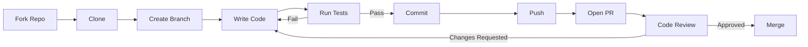

# Contributing to InfraCents

Thank you for your interest in contributing to InfraCents! This document provides guidelines and instructions for contributing.

---

## Table of Contents

1. [Code of Conduct](#code-of-conduct)
2. [How to Contribute](#how-to-contribute)
3. [Development Workflow](#development-workflow)
4. [Code Style](#code-style)
5. [Commit Messages](#commit-messages)
6. [Pull Request Process](#pull-request-process)
7. [Adding New Resource Types](#adding-new-resource-types)
8. [Reporting Bugs](#reporting-bugs)
9. [Requesting Features](#requesting-features)

---

## Code of Conduct

We are committed to providing a welcoming and inspiring community for all. Please be respectful, constructive, and professional in all interactions.

---

## How to Contribute

### Types of Contributions Welcome

- 🐛 **Bug fixes** — Found a bug? Fix it!
- ✨ **New resource types** — Add pricing support for more Terraform resources
- 📚 **Documentation** — Improve docs, add examples, fix typos
- 🧪 **Tests** — Increase test coverage
- 🎨 **UI improvements** — Enhance the dashboard experience
- ⚡ **Performance** — Optimize the pricing engine or webhook handling
- 🌐 **Internationalization** — Add support for new regions/currencies

### Getting Started

1. Fork the repository
2. Clone your fork: `git clone https://github.com/your-username/infracents.git`
3. Set up your development environment (see [docs/DEVELOPMENT.md](DEVELOPMENT.md))
4. Create a feature branch: `git checkout -b feature/my-feature`
5. Make your changes
6. Run tests: `make test`
7. Commit your changes (see [Commit Messages](#commit-messages))
8. Push and create a Pull Request

---

## Development Workflow



### Branch Naming

| Type | Pattern | Example |
|------|---------|---------|
| Feature | `feature/<description>` | `feature/add-azure-pricing` |
| Bug fix | `fix/<description>` | `fix/webhook-signature-validation` |
| Docs | `docs/<description>` | `docs/improve-api-reference` |
| Refactor | `refactor/<description>` | `refactor/pricing-engine-cache` |
| Test | `test/<description>` | `test/add-gcp-pricing-tests` |

---

## Code Style

### Python (Backend)

- **Formatter**: Black (line length 100)
- **Linter**: Flake8 + isort
- **Type Hints**: Required for all function signatures
- **Docstrings**: Google style, required for public functions

```python
def calculate_monthly_cost(
    resource_type: str,
    config: dict[str, Any],
    region: str = "us-east-1",
) -> CostEstimate:
    """Calculate the estimated monthly cost for a cloud resource.

    Args:
        resource_type: The Terraform resource type (e.g., "aws_instance").
        config: The resource configuration from the Terraform plan.
        region: The cloud provider region.

    Returns:
        A CostEstimate with the monthly cost breakdown.

    Raises:
        UnsupportedResourceError: If the resource type is not supported.
        PricingAPIError: If the pricing API is unavailable.
    """
```

### TypeScript (Frontend)

- **Formatter**: Prettier
- **Linter**: ESLint with Next.js config
- **Naming**: camelCase for variables/functions, PascalCase for components/types
- **Components**: Functional components with TypeScript interfaces for props

```typescript
interface CostChartProps {
  data: CostDataPoint[];
  period: '7d' | '30d' | '90d' | '1y';
  loading?: boolean;
}

export function CostChart({ data, period, loading = false }: CostChartProps) {
  // ...
}
```

### SQL

- **Keywords**: UPPERCASE (`SELECT`, `FROM`, `WHERE`)
- **Indentation**: 2 spaces
- **Table names**: snake_case, plural
- **Column names**: snake_case

---

## Commit Messages

We follow the [Conventional Commits](https://www.conventionalcommits.org/) specification:

```
<type>(<scope>): <description>

[optional body]

[optional footer(s)]
```

### Types

| Type | Description |
|------|-------------|
| `feat` | New feature |
| `fix` | Bug fix |
| `docs` | Documentation only |
| `style` | Code style (formatting, no logic change) |
| `refactor` | Code refactoring |
| `test` | Adding or updating tests |
| `chore` | Build, CI, dependencies |
| `perf` | Performance improvement |

### Examples

```
feat(pricing): add support for aws_elasticache_cluster

Add pricing lookup for ElastiCache Redis and Memcached clusters.
Supports node types from cache.t2.micro to cache.r6g.16xlarge.

Closes #42
```

```
fix(webhook): handle missing installation_id in PR events

Some GitHub webhook payloads don't include the installation_id
when the event is triggered by a GitHub Action. Fall back to
looking up the installation by repository.
```

---

## Pull Request Process

### Before Opening a PR

- [ ] Your code compiles and runs without errors
- [ ] You've added tests for new functionality
- [ ] All existing tests pass: `make test`
- [ ] Code is formatted: `make format`
- [ ] Linting passes: `make lint`
- [ ] You've updated relevant documentation
- [ ] You've added a changelog entry (if user-facing)

### PR Template

When you open a PR, please include:

```markdown
## Description
Brief description of what this PR does.

## Type of Change
- [ ] Bug fix
- [ ] New feature
- [ ] Breaking change
- [ ] Documentation update

## Testing
Describe the tests you ran and how to verify.

## Screenshots (if applicable)
For UI changes, include before/after screenshots.

## Checklist
- [ ] Tests added/updated
- [ ] Documentation updated
- [ ] Changelog entry added
- [ ] No new warnings
```

### Review Process

1. A maintainer will be automatically assigned to review
2. We aim to review PRs within 48 hours
3. Address any feedback — we're collaborative, not adversarial
4. Once approved, a maintainer will merge the PR

---

## Adding New Resource Types

One of the most valuable contributions is adding support for new Terraform resource types. Here's a step-by-step guide:

### 1. Add the Resource Mapping

In `backend/pricing_data/resource_mappings.py`, add an entry to `RESOURCE_MAPPINGS`:

```python
"aws_elasticache_cluster": ResourceMapping(
    provider="aws",
    service="AmazonElastiCache",
    description="ElastiCache Cluster",
    dimensions_extractor=extract_elasticache_dimensions,
    default_monthly_cost=25.00,  # Fallback estimate
),
```

### 2. Implement the Dimensions Extractor

```python
def extract_elasticache_dimensions(config: dict) -> PricingDimensions:
    return PricingDimensions(
        region=config.get("region", "us-east-1"),
        instance_type=config.get("node_type", "cache.t3.micro"),
        engine=config.get("engine", "redis"),
        num_nodes=config.get("num_cache_nodes", 1),
    )
```

### 3. Add the Pricing Lookup

In `backend/pricing_data/aws_pricing.py`, add the pricing logic:

```python
async def get_elasticache_price(dimensions: PricingDimensions) -> float:
    # Query AWS Price List API or use static fallback
    ...
```

### 4. Write Tests

```python
def test_parse_elasticache_cluster():
    plan = create_test_plan("aws_elasticache_cluster", {
        "node_type": "cache.r6g.large",
        "engine": "redis",
        "num_cache_nodes": 3,
    })
    result = parser.parse(plan)
    assert len(result.resources) == 1
    assert result.resources[0].resource_type == "aws_elasticache_cluster"

def test_price_elasticache_cluster():
    cost = await engine.get_cost("aws_elasticache_cluster", {
        "node_type": "cache.r6g.large",
        "engine": "redis",
        "num_cache_nodes": 3,
        "region": "us-east-1",
    })
    assert cost > 0
    assert cost == pytest.approx(474.12, rel=0.1)  # ~$0.219/hr * 3 nodes * 720 hrs
```

### 5. Update Documentation

Add the resource to the supported resources table in `docs/PRICING-ENGINE.md`.

---

## Reporting Bugs

Please use the [GitHub Issues](https://github.com/your-org/infracents/issues) page with the **Bug Report** template:

- **Description**: Clear description of the bug
- **Steps to Reproduce**: Numbered steps
- **Expected Behavior**: What you expected
- **Actual Behavior**: What actually happened
- **Environment**: OS, Python version, Node version
- **Logs/Screenshots**: If applicable

---

## Requesting Features

Use the **Feature Request** template on GitHub Issues:

- **Problem**: What problem does this solve?
- **Proposed Solution**: Your idea for how to solve it
- **Alternatives**: Other approaches you considered
- **Additional Context**: Screenshots, examples, etc.

---

## Questions?

- Open a [Discussion](https://github.com/your-org/infracents/discussions) on GitHub
- Tag a maintainer in your PR for guidance

Thank you for helping make InfraCents better! 🎉
