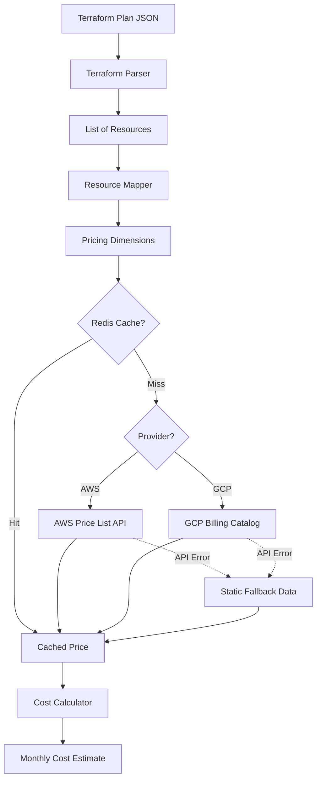
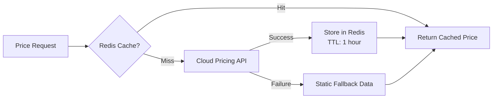

# Pricing Engine

The pricing engine is the core component of InfraCents. It translates Terraform resource definitions into estimated monthly costs by querying cloud provider pricing APIs.

---

## How It Works



### Step-by-Step Process

1. **Parse**: The Terraform plan JSON is parsed to extract a list of resources with their configurations
2. **Map**: Each Terraform resource type is mapped to pricing dimensions (instance type, region, storage size, etc.)
3. **Cache Check**: We check Redis for a cached price matching the resource's pricing dimensions
4. **API Query**: On cache miss, we query the appropriate cloud provider's pricing API
5. **Fallback**: If the API is unavailable, we use static pricing data bundled with the application
6. **Calculate**: The per-resource costs are aggregated into a total monthly estimate

---

## Pricing Data Sources

### AWS Price List API

- **Endpoint**: `https://pricing.us-east-1.amazonaws.com`
- **Authentication**: Public API (no credentials required for pricing data)
- **Format**: JSON with nested product/pricing structure
- **Update Frequency**: Real-time (we cache for 1 hour)
- **Documentation**: [AWS Price List API](https://docs.aws.amazon.com/awsaccountbilling/latest/aboutv2/price-changes.html)

### GCP Cloud Billing Catalog

- **Endpoint**: `https://cloudbilling.googleapis.com/v1/services`
- **Authentication**: API key or OAuth
- **Format**: JSON with SKU-based pricing
- **Update Frequency**: Real-time (we cache for 1 hour)
- **Documentation**: [GCP Cloud Billing Catalog](https://cloud.google.com/billing/docs/reference/rest)

### Static Fallback Data

- Bundled with the application in `backend/pricing_data/`
- Updated weekly via the `pricing-update` GitHub Action
- Used when APIs are unavailable or rate limited
- Covers all supported resource types with approximate pricing

---

## Supported Resource Types

### AWS Resources (15 types)

| Terraform Resource | Description | Pricing Dimensions | Confidence |
|-------------------|-------------|-------------------|------------|
| `aws_instance` | EC2 Instance | Instance type, region, OS, tenancy | ⭐⭐⭐ High |
| `aws_db_instance` | RDS Instance | Instance class, engine, region, multi-AZ, storage | ⭐⭐⭐ High |
| `aws_s3_bucket` | S3 Bucket | Storage class, region, estimated GB | ⭐⭐ Medium |
| `aws_lambda_function` | Lambda Function | Memory size, estimated invocations, region | ⭐⭐ Medium |
| `aws_lb` | Load Balancer | Type (ALB/NLB), region, estimated LCUs | ⭐⭐⭐ High |
| `aws_nat_gateway` | NAT Gateway | Region, estimated GB processed | ⭐⭐ Medium |
| `aws_ecs_service` | ECS Fargate Service | vCPU, memory, region, desired count | ⭐⭐⭐ High |
| `aws_elasticache_cluster` | ElastiCache | Node type, engine, num nodes, region | ⭐⭐⭐ High |
| `aws_dynamodb_table` | DynamoDB Table | Billing mode, RCU/WCU, region | ⭐⭐ Medium |
| `aws_ebs_volume` | EBS Volume | Volume type, size GB, IOPS, region | ⭐⭐⭐ High |
| `aws_cloudfront_distribution` | CloudFront | Price class, estimated GB/month | ⭐ Low |
| `aws_route53_zone` | Route 53 Zone | Hosted zone type | ⭐⭐⭐ High |
| `aws_sqs_queue` | SQS Queue | Queue type, estimated requests/month | ⭐ Low |
| `aws_sns_topic` | SNS Topic | Estimated notifications/month | ⭐ Low |
| `aws_secretsmanager_secret` | Secrets Manager | Number of secrets, estimated API calls | ⭐⭐⭐ High |

### GCP Resources (10 types)

| Terraform Resource | Description | Pricing Dimensions | Confidence |
|-------------------|-------------|-------------------|------------|
| `google_compute_instance` | Compute Engine VM | Machine type, region, OS, preemptible | ⭐⭐⭐ High |
| `google_sql_database_instance` | Cloud SQL | Tier, region, engine, storage, HA | ⭐⭐⭐ High |
| `google_storage_bucket` | Cloud Storage | Storage class, region, estimated GB | ⭐⭐ Medium |
| `google_cloudfunctions_function` | Cloud Functions | Memory, estimated invocations, region | ⭐⭐ Medium |
| `google_container_node_pool` | GKE Node Pool | Machine type, region, node count | ⭐⭐⭐ High |
| `google_compute_router_nat` | Cloud NAT | Region, estimated GB processed | ⭐⭐ Medium |
| `google_pubsub_topic` | Pub/Sub Topic | Estimated messages/month | ⭐ Low |
| `google_redis_instance` | Memorystore Redis | Tier, size GB, region | ⭐⭐⭐ High |
| `google_compute_disk` | Persistent Disk | Type, size GB, region | ⭐⭐⭐ High |
| `google_compute_address` | Static IP | Region, type (internal/external) | ⭐⭐⭐ High |

---

## Confidence Levels

Not all cost estimates are equally accurate. We use confidence levels to indicate how reliable an estimate is:

| Level | Icon | Meaning | When Used |
|-------|------|---------|-----------|
| High | ⭐⭐⭐ | ±10% accuracy | Resources with straightforward pricing (instance types, fixed fees) |
| Medium | ⭐⭐ | ±30% accuracy | Resources with usage-dependent pricing (storage, data transfer) |
| Low | ⭐ | ±50% accuracy | Resources with highly variable pricing (CDN, message queues) |

**Why confidence varies**: Some resources (like EC2 instances) have fixed hourly rates based on instance type. Others (like S3 or CloudFront) depend heavily on usage patterns that we can only estimate from the Terraform configuration.

---

## Pricing Dimensions

Each resource type maps to a set of "pricing dimensions" — the parameters that determine the cost. Here's how we extract them:

### Example: `aws_instance`

```hcl
resource "aws_instance" "web" {
  ami           = "ami-0c55b159cbfafe1f0"
  instance_type = "t3.large"
  
  root_block_device {
    volume_size = 50
    volume_type = "gp3"
  }
}
```

**Extracted dimensions**:
```python
{
    "instance_type": "t3.large",      # From resource config
    "region": "us-east-1",            # From provider or default
    "operating_system": "Linux",       # Inferred from AMI or default
    "tenancy": "Shared",              # From config or default
    "ebs_volume_size": 50,            # From root_block_device
    "ebs_volume_type": "gp3",         # From root_block_device
}
```

**Pricing calculation**:
```
EC2 hourly rate (t3.large, us-east-1, Linux) = $0.0832/hr
Monthly EC2 cost = $0.0832 × 730 hours = $60.74/mo

EBS rate (gp3, 50 GB, us-east-1) = $0.08/GB/mo
Monthly EBS cost = $0.08 × 50 = $4.00/mo

Total monthly cost = $60.74 + $4.00 = $64.74/mo
```

### Example: `aws_db_instance`

```hcl
resource "aws_db_instance" "main" {
  instance_class    = "db.r5.large"
  engine            = "postgres"
  allocated_storage = 100
  multi_az          = true
}
```

**Extracted dimensions**:
```python
{
    "instance_class": "db.r5.large",
    "engine": "postgres",
    "region": "us-east-1",
    "allocated_storage": 100,
    "multi_az": True,
    "storage_type": "gp2",  # Default
}
```

**Pricing calculation**:
```
RDS hourly rate (db.r5.large, postgres, multi-AZ) = $0.390/hr
Monthly RDS cost = $0.390 × 730 = $284.70/mo

Storage rate (gp2, 100 GB, multi-AZ) = $0.23/GB/mo × 2 (multi-AZ)
Monthly storage cost = $0.23 × 100 = $23.00/mo

Total monthly cost = $284.70 + $23.00 = $307.70/mo
```

---

## Adding a New Resource Type

### 1. Define the Resource Mapping

In `backend/pricing_data/resource_mappings.py`:

```python
RESOURCE_MAPPINGS["aws_new_resource"] = ResourceMapping(
    provider="aws",
    service="AmazonNewService",
    description="My New AWS Service",
    dimensions_extractor=extract_new_resource_dimensions,
    cost_components=[
        CostComponent(
            name="instance_hours",
            unit="Hrs",
            description="Instance running hours",
        ),
        CostComponent(
            name="storage",
            unit="GB-Mo",
            description="Storage per month",
        ),
    ],
    default_monthly_cost=50.00,
)
```

### 2. Implement the Dimensions Extractor

```python
def extract_new_resource_dimensions(config: dict) -> dict:
    """Extract pricing dimensions from the Terraform resource configuration."""
    return {
        "instance_type": config.get("instance_type", "default"),
        "region": config.get("region", "us-east-1"),
        "storage_gb": config.get("storage", 20),
    }
```

### 3. Add Pricing Lookup (if needed)

If the service isn't covered by the generic AWS Price List API handler, add a specific lookup in `backend/pricing_data/aws_pricing.py`:

```python
async def get_new_resource_price(dimensions: dict) -> float:
    """Get the monthly price for the new resource."""
    # Query the API or use static data
    hourly_rate = STATIC_PRICES.get(dimensions["instance_type"], 0.10)
    monthly_instance = hourly_rate * 730
    monthly_storage = dimensions["storage_gb"] * 0.10
    return monthly_instance + monthly_storage
```

### 4. Add Static Fallback Data

```python
STATIC_PRICES["aws_new_resource"] = {
    "default": 50.00,
    "small": 25.00,
    "large": 100.00,
}
```

### 5. Write Tests

```python
def test_parse_new_resource():
    # Test parsing
    ...

def test_price_new_resource():
    # Test pricing
    ...
```

### 6. Update This Document

Add the resource to the supported resources table above.

---

## Caching Strategy



### Cache Key Format

```
price:{provider}:{service}:{region}:{dimensions_hash}
```

Example:
```
price:aws:AmazonEC2:us-east-1:sha256(t3.large|Linux|Shared)
```

### TTL Strategy

| Data Type | TTL | Rationale |
|-----------|-----|-----------|
| Instance prices | 1 hour | Prices change infrequently |
| Storage prices | 1 hour | Same |
| Static fallback data | No expiry | Updated via CI/CD |
| Pricing API availability | 5 minutes | Quick recovery from outages |

---

## Accuracy Limitations

InfraCents provides **estimates**, not exact costs. Here's what can affect accuracy:

1. **Usage-dependent pricing**: Resources like S3, Lambda, and CloudFront have costs that depend on actual usage. We estimate based on configuration only.

2. **Reserved Instances / Savings Plans**: We always calculate on-demand pricing. If you have RIs or Savings Plans, actual costs will be lower.

3. **Free tier**: We don't account for AWS/GCP free tier benefits.

4. **Data transfer costs**: Inter-region and internet data transfer costs are difficult to estimate from Terraform configurations alone.

5. **Spot/Preemptible pricing**: We use on-demand pricing unless the resource is explicitly configured as spot/preemptible.

6. **Regional variations**: Pricing varies by region. We use the region from the Terraform configuration, falling back to `us-east-1` / `us-central1`.

7. **Currency**: All estimates are in USD. We don't currently support other currencies.
