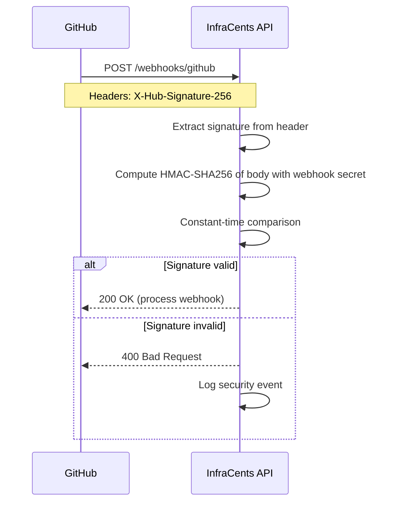
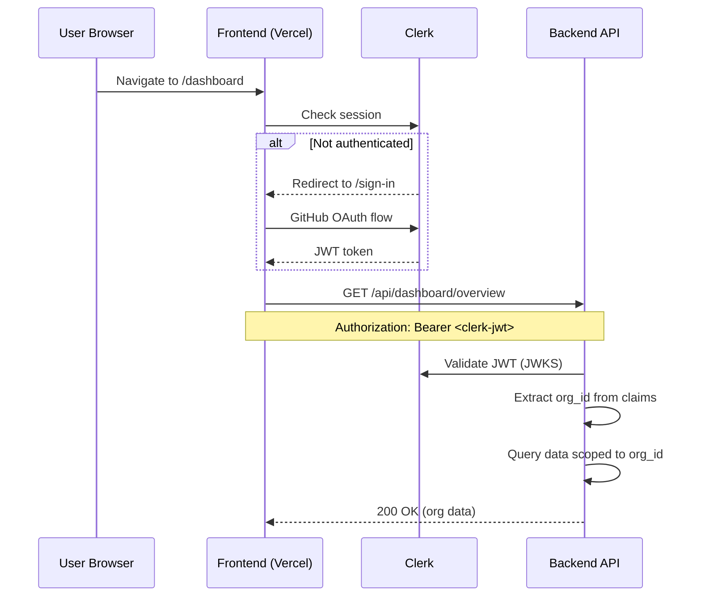

# Security

This document describes the security model, data handling practices, and threat analysis for InfraCents.

---

## Security Principles

1. **Minimal Permissions**: We request the absolute minimum GitHub permissions needed
2. **No Secrets Storage**: We never store or access cloud provider credentials
3. **Zero Trust**: Every request is authenticated and authorized independently
4. **Defense in Depth**: Multiple layers of security controls
5. **Transparency**: This document is public — security through obscurity is not our strategy

---

## GitHub App Permissions

InfraCents requests the following GitHub App permissions:

| Permission | Level | Why |
|-----------|-------|-----|
| Repository Contents | **Read** | To fetch `.tf` files from pull requests |
| Pull Requests | **Read & Write** | To post cost estimate comments |
| Metadata | **Read** | To list repositories (required by GitHub) |

**What we DON'T request:**
- ❌ Write access to code
- ❌ Access to secrets or environment variables
- ❌ Access to GitHub Actions or workflows
- ❌ Access to organization members or teams
- ❌ Access to issues, wikis, or other features

---

## Data Flow & Handling

### What Data We Process

| Data | Source | Purpose | Retention |
|------|--------|---------|-----------|
| `.tf` file contents | GitHub API | Parse resource definitions | Not stored (processed in memory) |
| PR metadata | GitHub webhook | Associate scans with PRs | Stored (scan records) |
| Cost estimates | Calculated | Display in PR comments & dashboard | Stored (historical data) |
| User identity | Clerk JWT | Authentication & authorization | Stored (user records) |
| Billing data | Stripe | Subscription management | Managed by Stripe |

### What Data We DON'T Process

- ❌ Cloud provider credentials (AWS keys, GCP service accounts)
- ❌ Terraform state files
- ❌ Non-Terraform files in the repository
- ❌ Source code beyond `.tf` files
- ❌ CI/CD secrets or environment variables
- ❌ Personal data beyond GitHub username and email

### Data Retention

| Data Type | Retention Period | Deletion |
|-----------|-----------------|----------|
| Scan results | Indefinite (user can delete) | On org deletion or request |
| User accounts | Until account deletion | 30 days after request |
| Webhook payloads | Not stored | Processed in memory only |
| Pricing cache | 1 hour TTL | Automatic expiration |
| Application logs | 30 days | Automatic rotation |

---

## Authentication & Authorization

### Webhook Authentication (GitHub → InfraCents)



**Implementation Details:**
- HMAC-SHA256 with the webhook secret configured in the GitHub App
- Constant-time comparison to prevent timing attacks
- Signature is verified before any payload processing
- Invalid signatures are logged for monitoring

### Dashboard Authentication (User → InfraCents)



**Implementation Details:**
- Clerk handles all authentication (GitHub OAuth)
- JWTs are validated against Clerk's JWKS endpoint
- Organization ID is extracted from JWT claims
- All data queries are scoped to the authenticated organization
- No cross-organization data access is possible

### Stripe Webhook Authentication

- Stripe webhook signatures are verified using the signing secret
- Events are processed idempotently (duplicate events are safe)

---

## Network Security

### TLS/SSL

- All endpoints require HTTPS (TLS 1.2+)
- Cloudflare provides edge TLS termination
- Backend-to-database connections use TLS
- Backend-to-Redis connections use TLS (`rediss://`)

### Rate Limiting

| Endpoint | Limit | Purpose |
|----------|-------|---------|
| Webhooks | 100/min per installation | Prevent webhook abuse |
| Dashboard API | 60/min per user | Prevent scraping |
| Billing API | 10/min per user | Prevent billing abuse |

### CORS

- Production: Only `infracents.dev` origin allowed
- Development: `localhost:3000` allowed
- No wildcard (`*`) origins in production

### Content Security Policy

```
default-src 'self';
script-src 'self' 'unsafe-inline' https://clerk.com;
style-src 'self' 'unsafe-inline';
img-src 'self' data: https:;
connect-src 'self' https://api.infracents.dev https://clerk.com;
```

---

## Infrastructure Security

### Google Cloud Run

- **No SSH access**: Cloud Run containers are immutable
- **Automatic patching**: Base images are updated automatically
- **IAM**: Service account with minimal permissions
- **VPC connector**: Optional for private network access to database

### Secrets Management

- All secrets stored in **Google Cloud Secret Manager**
- Secrets are injected as environment variables at runtime
- No secrets in source code, Docker images, or CI/CD logs
- Secret rotation supported without redeployment

### Container Security

```dockerfile
# Non-root user
RUN adduser --disabled-password --gecos "" appuser
USER appuser

# No shell (distroless base)
FROM python:3.11-slim
# Minimal attack surface
```

---

## Threat Model

### Threat 1: Malicious Webhook Payloads

**Attack**: An attacker sends forged webhook payloads to trigger cost scans or inject data.

**Mitigations**:
- HMAC-SHA256 signature verification (attacker cannot forge without the secret)
- Input validation on all webhook payload fields
- Rate limiting prevents flood attacks
- Payload size limits prevent memory exhaustion

### Threat 2: JWT Token Theft

**Attack**: An attacker steals a user's JWT token to access dashboard data.

**Mitigations**:
- Short-lived JWTs (15-minute expiry)
- Clerk handles token refresh securely
- HTTPS-only cookies prevent network interception
- Organization-scoped data limits blast radius

### Threat 3: SQL Injection

**Attack**: An attacker crafts malicious input to execute arbitrary SQL.

**Mitigations**:
- Parameterized queries (asyncpg with bound parameters)
- Pydantic input validation before any database interaction
- No raw SQL string concatenation
- Database user has minimal permissions (no DROP, no GRANT)

### Threat 4: Pricing Data Manipulation

**Attack**: An attacker modifies pricing data to show incorrect cost estimates.

**Mitigations**:
- Pricing data is fetched from official cloud APIs over HTTPS
- Redis cache has TTL — stale data expires automatically
- Static fallback data is committed to source control (auditable)
- Price anomaly detection flags unusual values

### Threat 5: Denial of Service

**Attack**: An attacker overwhelms the service with requests.

**Mitigations**:
- Cloudflare DDoS protection at the edge
- Rate limiting on all endpoints
- Cloud Run auto-scaling with concurrency limits
- Circuit breaker pattern for external API calls

### Threat 6: Cross-Organization Data Leakage

**Attack**: A user of one organization accesses data from another organization.

**Mitigations**:
- All database queries include `org_id` filter
- Organization ID extracted from authenticated JWT (not user input)
- Row Level Security (RLS) at the database level
- Automated tests verify data isolation

---

## Incident Response

### Severity Levels

| Level | Description | Response Time | Example |
|-------|-------------|---------------|---------|
| P0 - Critical | Data breach, service completely down | < 1 hour | Unauthorized data access |
| P1 - High | Major feature broken, security vulnerability | < 4 hours | Webhook processing failure |
| P2 - Medium | Minor feature broken, performance degradation | < 24 hours | Dashboard slow to load |
| P3 - Low | Cosmetic issues, feature requests | < 1 week | Typo in PR comment |

### Response Procedure

1. **Detect**: Sentry alerts, user reports, monitoring dashboards
2. **Assess**: Determine severity and blast radius
3. **Contain**: Isolate affected systems if needed
4. **Communicate**: Notify affected users (status page)
5. **Fix**: Deploy hotfix or mitigation
6. **Review**: Post-incident review within 48 hours

---

## Compliance

### SOC 2 Compatibility

InfraCents is designed with SOC 2 compliance in mind:

- **Availability**: Cloud Run auto-scaling, health checks, monitoring
- **Security**: Encryption in transit and at rest, access controls, audit logging
- **Confidentiality**: Minimal data collection, scoped access, data retention policies
- **Processing Integrity**: Input validation, error handling, automated testing
- **Privacy**: No personal data beyond GitHub profile, GDPR-compatible deletion

### GDPR

- Users can request data export (all data associated with their organization)
- Users can request data deletion (removes all organization data within 30 days)
- No data is transferred outside the deployment region
- Data processing agreement available for Enterprise customers

---

## Security Contact

If you discover a security vulnerability, please report it responsibly:

- **Email**: security@infracents.dev
- **Do NOT** open a public GitHub issue for security vulnerabilities
- We will acknowledge receipt within 24 hours
- We aim to provide a fix within 7 days for critical issues
- We appreciate responsible disclosure and will credit reporters (with permission)
